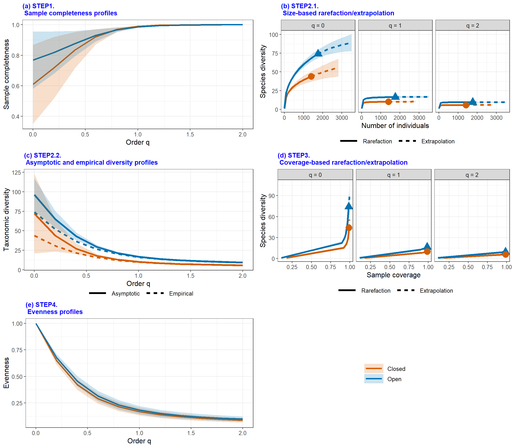
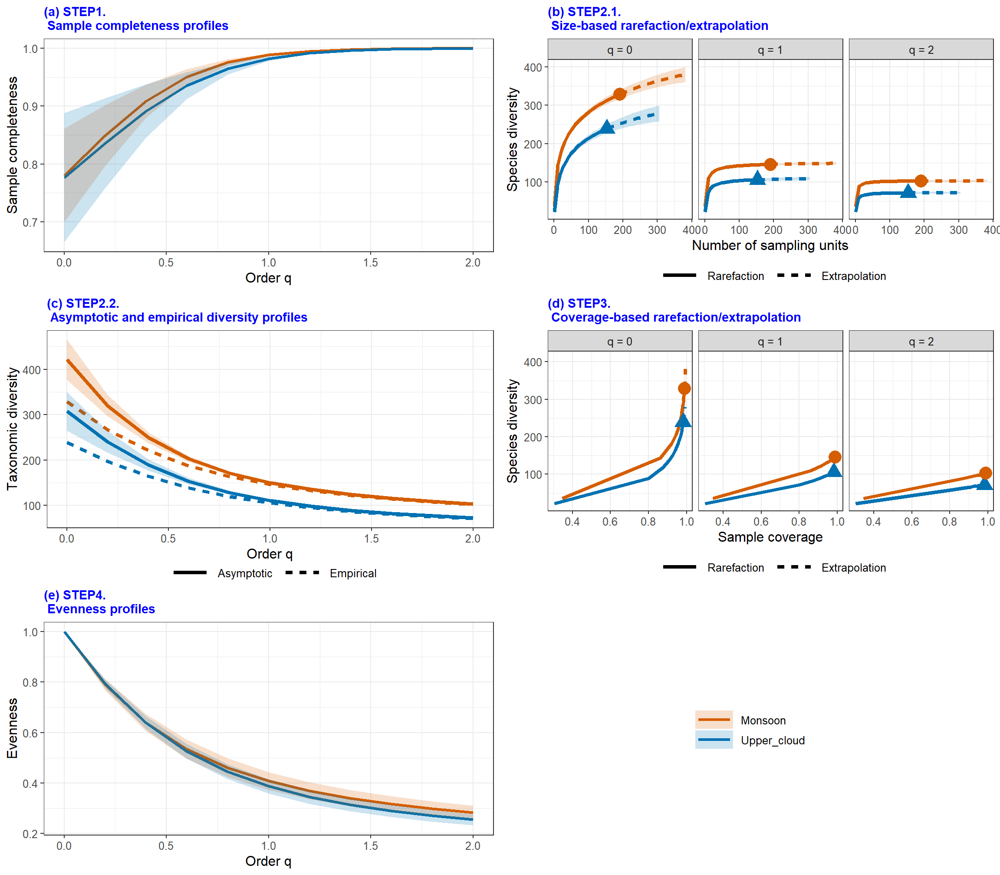
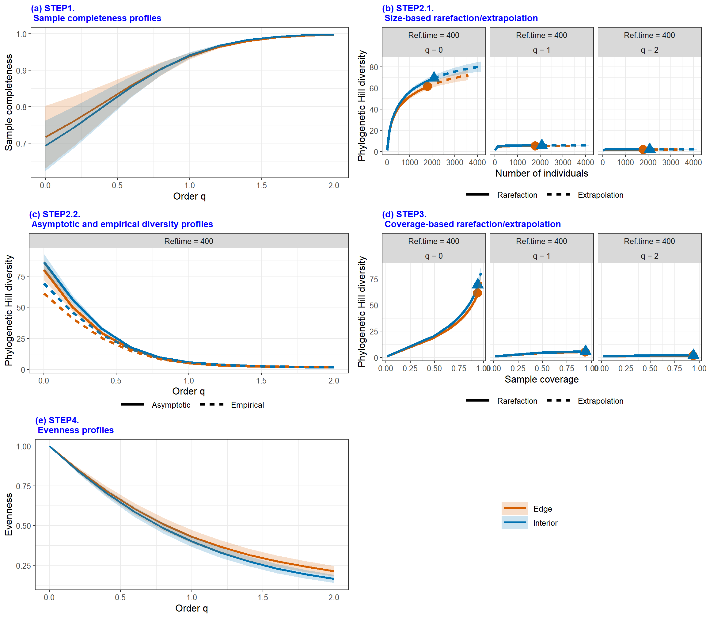
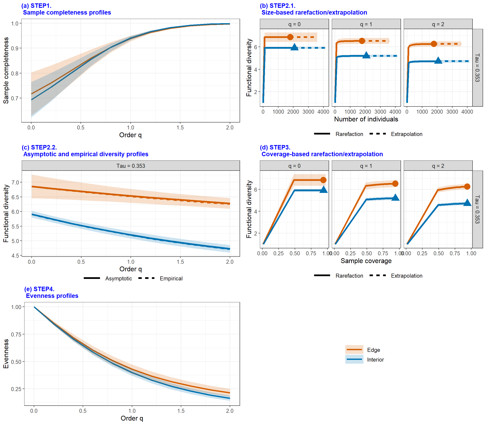
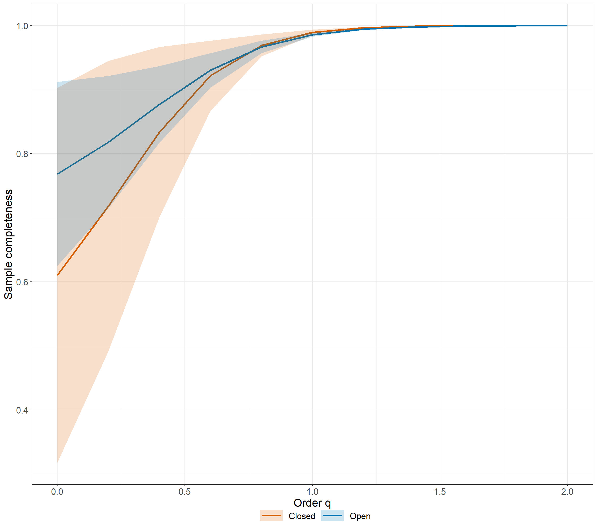
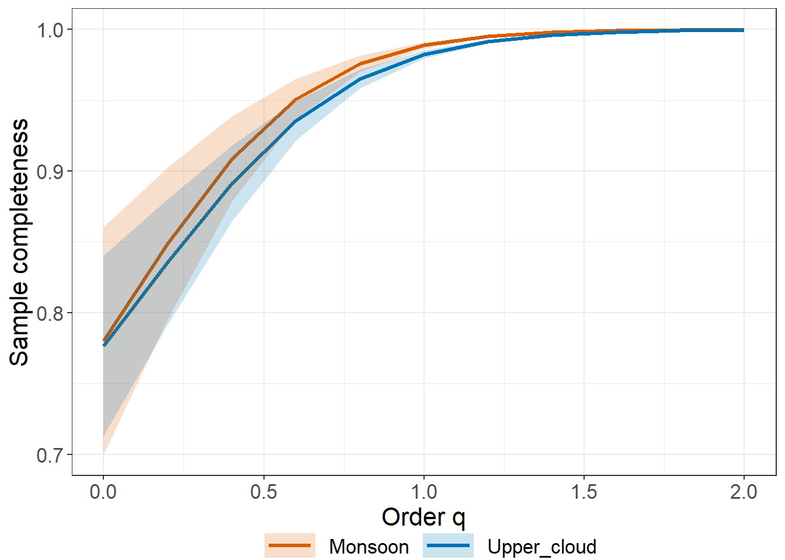
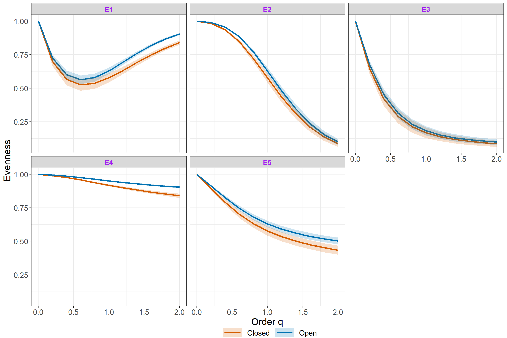
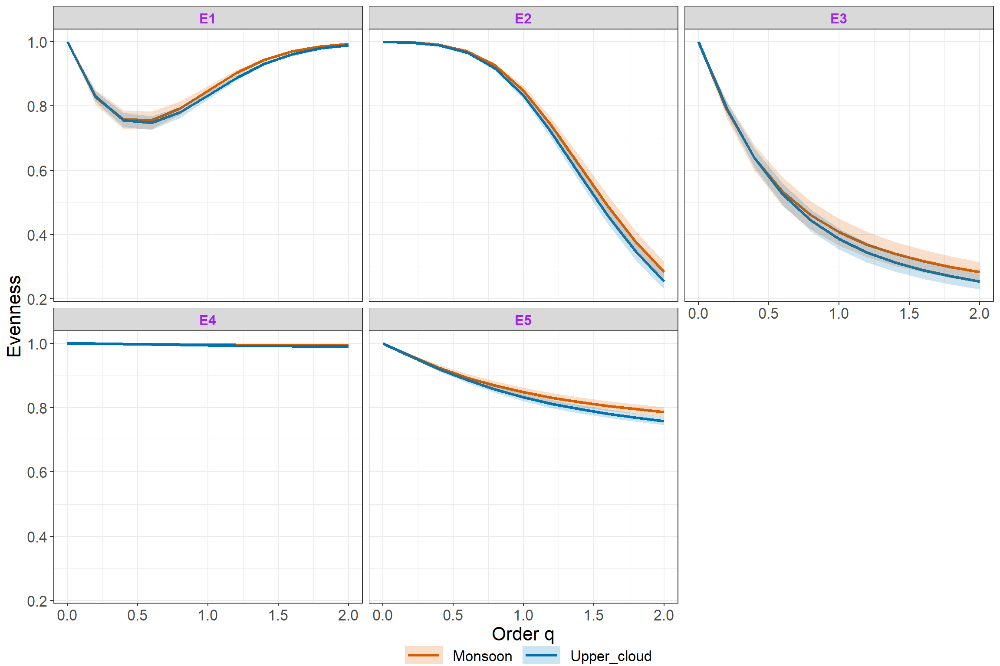

<!-- README.md is generated from README.Rmd. Please edit that file -->

# iNEXT.4steps (R package)

<h5 align="right">
Latest version: 2023-04-10
</h5>
<font color="394CAE">
<h3 color="394CAE" style="font-weight: bold">
Introduction to iNEXT.4steps (R package): Excerpt from iNEXT.4steps
User’s Guide
</h3>
</font> <br>
<h5>
<b>Hsieh, Anne Chao, Kai-Hsiang Hu</b> <br><br> <i>Institute of
Statistics, National Tsing Hua University, Hsin-Chu, Taiwan 30043</i>
</h5>

<br> NEXT.4steps (iNterpolation and EXTrapolation for four steps) is an
original R package available in [Github](https://github.com/AnneChao)
which provide an easy complete biological analysis computation. In Chao,
A., Y. Kubota, D. Zelený, C.-H. Chiu(2020), they proposed a complete
biological analysis process:

-   `STEP1`. Sample completeness profiles.

-   `STEP2`. <font color=#FF6781> Size-based rarefaction and
    extrapolation analysis and the asymptotic diversity profile. </font>

-   `STEP3`. Non-asymptotic coverage-based rarefaction and extrapolation
    analysis.

-   `STEP4`. Evenness among species abundances.

These are the foundation of `iNEXT.4steps`. Here we will introduce
functions about `STEP1` and `STEP4`, particularly. If you want to grasp
`STEP2`, `STEP3`, then the related paper T.C. Hsieh, K. H. Ma, and Chao,
A. (2016) or the packages (`iNEXT.3D`) will be the best choice to you.
An online version of [iNEXT.4steps
Online](https://chao.shinyapps.io/iNEXT_4steps/) is also available for
users without an R background. Detailed information about all functions
in iNEXT.4steps is provided in the iNEXT.4steps Manual in
[iNEXT.4steps_vignettes](http://chao.stat.nthu.edu.tw/wordpress/wp-content/uploads/software/A%20Quick%20Introduction%20to%20iNEXT.4steps%20via%20Examples.html),which
is available from [Anne Chao’s
website](http://chao.stat.nthu.edu.tw/wordpress/software_download/).

`iNEXT.3D` contains two major parts:

1.  Non-asymptotic diversity:

<!-- -->

1.  Sample-size-based <font color=#FF6781>(or size-based)</font> R/E
    sampling curves: `iNEXT3D` computes rarefied and extrapolated
    <font color=#FF6781>Taxonomic, Phylogenetic or Functional</font>
    diversity estimates under a specified sample size. This type of
    diversity curve plots the estimated diversity with respect to sample
    size.

2.  Coverage-based R/E sampling curves: `iNEXT3D` computes rarefied and
    extrapolated <font color=#FF6781>Taxonomic, Phylogenetic or
    Functional</font> diversity estimates under a specified sample
    coverage. This type of diversity curve plots the estimated diversity
    with respect to sample coverage.

<!-- -->

1.  Asymptotic diversity: asymptotic <font color=#FF6781>Taxonomic,
    Phylogenetic or Functional</font> diversity estimate with q-profile,
    time-profile, and tau-profile.

In `iNEXT.4steps` package, we provide other four functions for users to
calculate <font color=#FF6781>and visualize the related biological
statistics: `Completeness` and `Evenness`, for calculation.
`ggCompleteness` and `ggEvenness`, for visualization .</font> The most
comprehensive function `iNEXT4steps` gathers `iNEXT3D`, `AO3D`,
`Completeness` and `Evenness` into a figure. In this document, we will
give a quick introduction demonstrating how to run these functions.
Detailed information about these function settings is provided in the
`iNEXT.4steps` Manual. The theoretical basis about these biological
statistics can be obtained from the following inference:
(<http://chao.stat.nthu.edu.tw/wordpress/paper/135.pdf>)

### SOFTWARE NEEDED TO RUN iNEXT.4steps IN R

-   Required: [R](http://cran.rstudio.com/)
-   Suggested: [RStudio IDE](http://www.rstudio.com/ide/download/)

### HOW TO RUN INEXT.4STEPS:

The `iNEXT.4steps` package can be downloaded from Anne Chao’s
[iNEXT.4steps_github](https://github.com/AnneChao/iNEXT.4steps) using
the following commands. For a first-time installation, an additional
visualization extension package (`ggplot2`) and (`iNEXT.3D`) from Anne
Chao’s github must be installed and loaded.

``` r
## install the latest version from github
install.packages('devtools')
library(devtools)

install_github('AnneChao/iNEXT.4steps')
## import packages
library(iNEXT.4steps)

# install_github('AnneChao/iNEXT.3D')
# library(iNEXT.3D)

library(ggplot2)
```

## SIMPLE STEPS BRIEF

`Sample Completeness` represent the proportion of observed species in
the population. Usually, the sampling data represents the abundant
species in the population so that we will ignore the rare species. Here
we will use Turing’s sample coverage theory to reconstruct the
population proportion. Besides, sample completeness can correspond to
order q, which is an weight index. When order q tends to zero, then we
will give more weight to rare species. If order q tends to unity, then
we will equally treat each species, which is also called sample coverage
at unity. In contrast, if order q tends to larger than unity, we will
give more weights to abundant species. By sample completeness, we can
easily plot the estimated curve with respect to order q and associated
95% confidence interval.

`Asymptotic Diversity (or called Hill numbers)` is a statistic which is
used to represent the biological diversity. Its direct meaning is to
transform the non-homogeneous distribution into homogeneous distribution
(species diversity). With this quantification criterian, we can easily
analysis several communities for different data sources in an objective
measure. It usually matches order q to give different weights so that we
can focus on rare species or abundant species only. When we use observed
data to calculate empirical diversity, we usually get an underestimated
value. In our package, we will provide an estimated statistic from Anne
Chao (2015), which can imitate a real population accurately. In
addition, it can be related to order q index and associated 95%
confidence interval.

`Interpolation and Extrapolation (iNEXT)` focuses on three measures of
order q: species richness (q = 0), Shannon diversity (q = 1, the
exponential of Shannon entropy), and Simpson diversity (q = 2, the
inverse of Simpson concentration). For each diversity measures, iNEXT
uses observed sample to compute expected diversity estimates and
associated 95% confidence intervals according two different unit types
of rarefaction and extrapolation (R/E):

1.  Sample-size-based R/E sampling curves versus diversity in each
    order q.

2.  Coverage-based R/E sampling curves versus diversity in each order q.

For more particular usage about iNEXT, you can refer to T.C. Hsieh, K.
H. Ma, and Chao, A. (2016). We won’t introduce details of iNEXT latter.

`Evenness` is an function to calculate whether a assemblage is uniform
or not. We have sorted five main classes according to different
transformation by species and diversity. In these five classes, they all
have range from zero to one. When the value is close to zero, it means
that the assemblage tends to uneven. On the contrary, when the value is
close one, it means that the assemblage tends to even. Evenness can
consider different order q under each classes. When order q tends to
zero, we will focus on rare species. In other sides, when order q tends
to far from zero, then we will do more weights on abundant species. If
we use observed sampling data to calculate Evenness, we usually have a
biased value because of unobserved rare species. But if we try to use
asymptotic diversity for calculating Evenness, then we may also get a
biased value when order q is near zero. Here, we propose a “standardized
coverage” (named `Cmax`) as a judged criterion. `Cmax` means that we
computes the diversity estimates for the minimum sample coverage among
all samples extrapolated to double reference sizes. Under Cmax, we can
guarantee the accuracy of Evenness. According to this criterion, we can
plot the Evenness curves versus order q and associated 95% confidence
interval.

## DATA FORMAT/INFORMATION

Three types of data are supported:

1.  Individual-based abundance data (`datatype="abundance"`): Input data
    for each assemblage/site include species abundances in an empirical
    sample of n individuals (“reference sample”). When there are N
    assemblages, input data consist of an S by N abundance matrix, or N
    lists of species abundances.

2.  Sampling-unit-based incidence data: There are two kinds of input
    data.  

<!-- -->

1.  Incidence-raw data (`datatype="incidence_raw"`): for each
    assemblage, input data for a reference sample consisting of a
    species-by-sampling-unit matrix; each element in the raw matrix is 1
    for a detection, and 0 otherwise. When there are N assemblages,
    input data consist of N lists of raw matrices, and each matrix is a
    species-by-sampling-unit matrix.  
2.  Incidence-frequency data (`datatype="incidence_freq"`): input data
    for each assemblage consist of species sample incidence frequencies
    (i.e., row sums of the corresponding incidence raw matrix). When
    there are N assemblages, input data consist of an (S+1) by N matrix,
    or N lists of species incidence frequencies. The first entry of each
    column/list must be the total number of sampling units, followed by
    the species incidence frequencies.

## MAIN FUNCTION: iNEXT4steps()

We first describe the main function `iNEXT4steps()` with default
arguments:

<br><br> iNEXT4steps(data, diversity = “TD”, q = seq(0, 2, 0.2),
datatype = “abundance”, nboot = 50, nT = NULL, PDtree = NULL, PDreftime
= NULL, PDtype = “meanPD”, FDdistM = NULL, FDtype = “AUC”, FDtau = NULL,
details = FALSE ) <br><br>

The arguments of this function are briefly described below, and will
explain details by illustrative examples in later text.

<table class='gmisc_table' style='border-collapse: collapse; margin-top: 1em; margin-bottom: 1em;' >
<thead>
<tr>
<th style="font-weight: 900; border-bottom: 1px solid grey; border-top: 2px solid grey; text-align: center;">
Argument
</th>
<th style="font-weight: 900; border-bottom: 1px solid grey; border-top: 2px solid grey; text-align: center;">
Description
</th>
</tr>
</thead>
<tbody>
<tr>
<td style="text-align: left;">
data
</td>
<td style='text-align: left;'>

1.  For `datatype = 'abundance'`, data can be input as a vector of
    species abundances (for a single assemblage), matrix/data.frame
    (species by assemblages), or a list of species abundance
    vectors. (b) For `datatype = 'incidence_freq'`, data can be input as
    a vector of incidence frequencies (for a single assemblage),
    matrix/data.frame (species by assemblages), or a list of incidence
    frequencies; the first entry in all types of input must be the
    number of sampling units in each assemblage. (c) For
    `datatype = 'incidence_raw'`, data can be input as a list of
    matrix/data.frame (species by sampling units); data can also be
    input as a matrix/data.frame by merging all sampling units across
    assemblages based on species identity; in this case, the number of
    sampling units (nT, see below) must be input.
    </td>
    </tr>
    <tr>
    <td style="text-align: left;">
    diversity
    </td>
    <td style="text-align: left;">
    selection of diversity type: ‘TD’ = Taxonomic diversity, ‘PD’ =
    Phylogenetic diversity, and ‘FD’ = Functional diversity.
    </td>
    </tr>
    <tr>
    <td style="text-align: left;">
    q
    </td>
    <td style="text-align: left;">
    a numerical vector specifying the diversity orders. Default is c(0,
    1, 2).
    </td>
    </tr>
    <tr>
    <td style="text-align: left;">
    datatype
    </td>
    <td style="text-align: left;">
    data type of input data: individual-based abundance data (datatype =
    ‘abundance’), sampling-unit-based incidence frequencies data
    (datatype = ‘incidence_freq’), or species by sampling-units
    incidence matrix (datatype = ‘incidence_raw’) with all entries being
    0 (non-detection) or 1 (detection).
    </td>
    </tr>
    <tr>
    <td style="text-align: left;">
    nboot
    </td>
    <td style="text-align: left;">
    a positive integer specifying the number of bootstrap replications
    when assessing sampling uncertainty and constructing confidence
    intervals. Enter 0 to skip the bootstrap procedures. Default is 50.
    </td>
    </tr>
    <tr>
    <td style="text-align: left;">
    nT
    </td>
    <td style="text-align: left;">
    (required only when datatype = ‘incidence_raw’ and input data is
    matrix/data.frame) a vector of nonnegative integers specifying the
    number of sampling units in each assemblage. If assemblage names are
    not specified, then assemblages are automatically named as
    ‘assemblage1’, ‘assemblage2’,…, etc.
    </td>
    </tr>
    <tr>
    <td style="text-align: left;">
    PDtree
    </td>
    <td style="text-align: left;">
    (required only when diversity = ‘PD’), a phylogenetic tree in Newick
    format for all observed species in the pooled assemblage.
    </td>
    </tr>
    <tr>
    <td style="text-align: left;">
    PDreftime
    </td>
    <td style="text-align: left;">
    (required only when diversity = ‘PD’), a vector of numerical values
    specifying reference times for PD. Default is NULL (i.e., the age of
    the root of PDtree).
    </td>
    </tr>
    <tr>
    <td style="text-align: left;">
    PDtype
    </td>
    <td style="text-align: left;">
    (required only when diversity = ‘PD’), select PD type: PDtype = ‘PD’
    (effective total branch length) or PDtype = ‘meanPD’ (effective
    number of equally divergent lineages). Default is ‘meanPD’, where
    meanPD = PD/tree depth.
    </td>
    </tr>
    <tr>
    <td style="text-align: left;">
    FDdistM
    </td>
    <td style="text-align: left;">
    (required only when diversity = ‘FD’), select FD type: FDtype =
    ‘tau_values’ for FD under specified threshold values, or FDtype =
    ‘AUC’ (area under the curve of tau-profile) for an overall FD which
    integrates all threshold values between zero and one. Default is
    ‘AUC’.
    </td>
    </tr>
    <tr>
    <td style="text-align: left;">
    FDtype
    </td>
    <td style="text-align: left;">
    (required only when diversity = ‘FD’), select FD type: FDtype =
    ‘tau_values’ for FD under specified threshold values, or FDtype =
    ‘AUC’ (area under the curve of tau-profile) for an overall FD which
    integrates all threshold values between zero and one. Default is
    ‘AUC’.
    </td>
    </tr>
    <tr>
    <td style="text-align: left;">
    FDtau
    </td>
    <td style="text-align: left;">
    (required only when diversity = ‘FD’ and FDtype = ‘tau_values’), a
    numerical vector between 0 and 1 specifying tau values (threshold
    levels). If NULL (default), then threshold is set to be the mean
    distance between any two individuals randomly selected from the
    pooled assemblage (i.e., quadratic entropy).
    </td>
    </tr>
    <tr>
    <td style="border-bottom: 2px solid grey; text-align: left;">
    details
    </td>
    <td style="border-bottom: 2px solid grey; text-align: left;">
    a logical variable to decide whether do you want to print out the
    detailed value for each plots, default is `FALSE`.
    </td>
    </tr>
    </tbody>
    </table>

Here data can be any diversity type, such as a list gathered by each
vector, a data frame with each column versus a assemblage, a vector
correspond to a assemblage. Besides, `datatype` means that you should be
certain what type your data is. Diversity dimension can be classified
into three attributes diversity: ‘Taxonomic diversity’, ‘Phylogenetic
diversity’, and ‘Functional diversity’. So you should choose one
`diversity` : `TD` means ‘Taxonomic diversity’, `PD` means ‘Phylogenetic
diversity’ under a certain reference time(root), and `FD` means
‘Functional diversity’. For the `”Functional diversity”`,
`FDtype = "AUC"` is a conservative computation for functional diversity
which integrate threshold between zero and one. And
`FDtype = "tau_values"` computes functional diversity under certain
threshold. Besides, when you choose `diversity = “PD”`, you should input
`PDtree` data. When you choose `'FD'`, you should also input `FDdistM`
data, which represents distance matrix.

`datatype` has been introduced before. When the user use
`datatype = "incidence_raw"` and class of data is ‘data.frame’ or
‘matrix’, user should input `nT` for each assemblage which represents
sampling units. `nboot` are applied to confidence interval, which is
estimated by re-sampling method: bootstrap with `nboot` times. Finally,
`details` means a logical setting whether do you want to print out total
information of five figures.

The output of `iNEXT4steps` will have three parts (if you sets
`details = TRUE`): `$summary`, `$figure`, and `$details`. It may take
you much time to calculate five figures if your data is large or you set
a large number of `nboot.`

## Taxonomic Diversity

`“abundance Data”` usually indicated a random sampling source, and the
individuals spread uniformly all over the area. If the species in your
data has gathering effect, such as a kind of plant usually live near
each other instead of spreading uniformly, then we will propose
`datatype = “incidence_freq”` or `datatype = “incidence_raw”`. So user
can follow a rule: `datatype = “abundance”` for animals and
`datatype = “incidence”` for plants. First, we try to calculate
taxonomic diversity for `Spider`

### Spider abundance-based data

These data were sampled in a mountain forest ecosystem in the Bavarian
Forest National Park, Germany (Thorn et al. 2016, 2017). A total of 12
experimental plots were established in “closed forest” stands (6 plots)
and “open forest” stands with naturally occurring gaps and edges (6
plots) to assess the effects of microclimate on communities of epigeal
(ground-dwelling) spiders. Epigeal spiders were sampled over three years
with four pitfall traps in each plot, yielding a total of 3171
individuals belonging to 85 species recorded in the pooled habitat.

Data Source : A mountain forest ecosystem in the Bavarian Forest
National Park, Germany (Thorn et al. 2016, 2017).

## Abundance-based

``` r
data(Spider)
out1 <- iNEXT4steps(data = Spider, diversity = "TD", datatype = "abundance")
out1$summary
$`STEP1. Sample completeness profiles`
  Assemblage q = 0 q = 1 q = 2
1     Closed  0.61  0.99     1
2       Open  0.77  0.99     1

$`STEP2. Asymptotic analysis`
  Assemblage         Diversity Observed Estimator  s.e.   LCL    UCL
1     Closed  Species richness    44.00     72.11 29.48 44.00 129.89
2     Closed Shannon diversity    10.04     10.30  0.43  9.46  11.14
3     Closed Simpson diversity     5.71      5.73  0.25  5.23   6.22
4       Open  Species richness    74.00     96.31 11.44 74.00 118.72
5       Open Shannon diversity    16.34     16.84  0.54 15.77  17.91
6       Open Simpson diversity     9.41      9.46  0.31  8.86  10.06

$`STEP3. Non-asymptotic coverage-based rarefaction and extrapolation analysis`
  Cmax = 0.994 q = 0 q = 1 q = 2
1       Closed 55.62 10.18  5.72
2         Open 86.51 16.59  9.43

$`STEP4. Evenness among species abundances`
       Pielou J' q = 1 q = 2
Closed      0.58  0.17  0.09
Open        0.63  0.18  0.10
out1$figure[[6]]
```



`$summary` lists all biological index according to Chao, A ., Y. Kubota,
D. Zelený, C.-H. Chiu (2020). There are four parts corresponding to each
step in the paper. They analysis and explain biological data from
different and superimposed side. So users can easily compare difference
between each assemblages.

`$figure` visualize the statistics by continuous curves. From the above
five figures, we provide a standard analysis process from figure (a) to
figure (e). Except that figure (c) contains empirical statistics, all
the other figures are estimated statistics. You can understand these
estimated statistics through reference paper in the final page.

`$details` contains four parts: `Sample Completeness`, `iNEXT`,
`Asymptotic Diversity`, `Evenness`. Each meaning will be introduced in
the individual function latter (except figure (b) and fugure (d)).

## Incidence-based

Incidence data usually match by incidence-sampling-units. We split an
area into several the same-size area and only care whether the species
is detected or non-detected. According to this sampling method,
`incidence_raw` data has value “zero” and “one”. And `incidence_freq`
data is the total frequency incidence in each assemblage. You should
input your total sampling units (plots number) in the first row.
*Remark:* The phylogenetic diversity can only select
`datatype = “incidence_raw”` for incidence-based data.

## Woody plants incidence-based data

The datasets considered here are a subset of The National Vegetation
Database of Taiwan (AS-TW-001), sampled between 2003 and 2007 within the
first national vegetation inventory project (Chiou et al. 2009). Over
3600 vegetation plots, each 20x20-m in area, were set up in various
locations in Taiwan, and all woody plant individuals taller than 2
meters were recorded in each plot. For illustration here, we selected
only plots belonging to two vegetation types (according to Li et
al. 2013): Pyrenaria-Machilus subtropical winter monsoon forest and
Chamaecyparis montane mixed cloud forest, sampled in the northern part
of Taiwan (in ecoregions 7 and 8 according to Su 1985).

Data Source : The National Vegetation Database of Taiwan (AS-TW-001).

``` r
data(woody_plants)
out2 <- iNEXT4steps(data = woody_plants[,c(1,4)], diversity = "TD", datatype = "incidence_freq")
out2$summary
$`STEP1. Sample completeness profiles`
   Assemblage q = 0 q = 1 q = 2
1     Monsoon  0.78  0.99     1
2 Upper_cloud  0.78  0.98     1

$`STEP2. Asymptotic analysis`
   Assemblage         Diversity Observed Estimator  s.e.    LCL    UCL
1     Monsoon  Species richness   329.00    421.67 17.73 386.92 456.43
2     Monsoon Shannon diversity   145.65    150.15  1.95 146.32 153.98
3     Monsoon Simpson diversity   102.33    103.35  1.31 100.77 105.93
4 Upper_cloud  Species richness   239.00    307.78 18.20 272.11 343.44
5 Upper_cloud Shannon diversity   105.53    110.50  1.99 106.59 114.41
6 Upper_cloud Simpson diversity    71.17     72.23  1.29  69.69  74.76

$`STEP3. Non-asymptotic coverage-based rarefaction and extrapolation analysis`
  Cmax = 0.993  q = 0  q = 1  q = 2
1      Monsoon 359.80 147.29 102.67
2  Upper_cloud 278.96 108.52  71.69

$`STEP4. Evenness among species abundances`
            Pielou J' q = 1 q = 2
Monsoon          0.85  0.41  0.28
Upper_cloud      0.83  0.39  0.25
out2$figure[[6]]
```



## Phylogenetic Diversity

Next, we want to calculate `Phylogenetic diversity`. Here we provide
`“abundance”` data : `“brazil”` as our example. `“brazil”` data has two
main communities: “Edge”, “Interior”. Here we provide phylogenetic tree
data and pair-wise distance matrix of `“brazil”` data. User can match
these to fit phylogenetic diversity or functional diversity.
Phylogenetic diversity needs a tree data which has newick-format, which
is related to evolution history. We can choose a historic time
`PDreftime` as beginning of evolution. Then phylogenetic diversity will
be calculated in a time range from now to `PDreftime`

If user don’t input tree data, the error will jump out. So if user don’t
have tree data, taxonomic diversity will be your best choice.

According to following R code, we can get similar output with taxonomic
diversity.

If you want to use incidence-based data, you should use
`datatype = "incidence_raw"` with incidence raw data.

``` r
data(brazil)
data(brazil_tree)
out3 <- iNEXT4steps(data = brazil, diversity = "PD", datatype = "abundance", nboot = 20, PDtree = brazil_tree)
out3$summary
$`STEP1. Sample completeness profiles`
  Assemblage q = 0 q = 1 q = 2
1       Edge  0.72  0.94     1
2   Interior  0.69  0.94     1

$`STEP2. Asymptotic analysis`
  Assemblage Phylogenetic.Diversity Phylogenetic.Observed Phylogenetic.Estimator s.e.   LCL   UCL Reftime   Type
1       Edge               q = 0 PD                 61.29                  80.03 4.90 70.42 89.63     400 meanPD
2       Edge               q = 1 PD                  5.25                   5.37 0.10  5.17  5.57     400 meanPD
3       Edge               q = 2 PD                  1.80                   1.80 0.03  1.75  1.85     400 meanPD
4   Interior               q = 0 PD                 69.32                  86.38 3.96 78.61 94.14     400 meanPD
5   Interior               q = 1 PD                  5.72                   5.85 0.11  5.65  6.06     400 meanPD
6   Interior               q = 2 PD                  1.91                   1.91 0.03  1.85  1.98     400 meanPD

$`STEP3. Non-asymptotic coverage-based rarefaction and extrapolation analysis`
  Cmax = 0.973 q = 0 q = 1 q = 2
1         Edge 71.76  5.32  1.80
2     Interior 80.32  5.80  1.91

$`STEP4. Evenness among species abundances`
         Pielou J' q = 1 q = 2
Edge          0.86  0.43  0.21
Interior      0.85  0.40  0.16
out3$figure[[6]]
```



## Functional Diversity

Next, we use distance matrix of `brazil` data to calculate functional
diversity. If user doesn’t input distance matrix, than the error will
jump out. Distance matrix is a species pairwise matrix which means the
distance between any two species. The value in distance matrix has range
from zero to one. The higher the value is, the more different the
species is. If the value is “0”, it means the same species in the
criterion. (“0” appears in the diagonal term)

So, without distance matrix, taxonomic diversity will be you best
choose. User can select `FDtau` to decide a threshold which can express
the difference distance in any two species. If `FDtau` is small, then
all species will be seen as different species. If `FDtau` is large, then
all species will be seen as the same species.

``` r
data(brazil)
data(brazil_distM)
out4 <- iNEXT4steps(data = brazil, diversity = "FD", datatype = "abundance", nboot = 20, FDdistM = brazil_distM, FDtype = 'tau_values')
out4$summary
$`STEP1. Sample completeness profiles`
  Assemblage q = 0 q = 1 q = 2
1       Edge  0.72  0.94     1
2   Interior  0.69  0.94     1

$`STEP2. Asymptotic analysis`
  Assemblage Functional.Diversity Functional.Observed Functional.Estimator s.e.  LCL  UCL  Tau
1       Edge q = 0 FD(single tau)                6.86                 6.86 0.20 6.86 7.26 0.35
2       Edge q = 1 FD(single tau)                6.52                 6.54 0.15 6.24 6.83 0.35
3       Edge q = 2 FD(single tau)                6.26                 6.28 0.14 6.01 6.55 0.35
4   Interior q = 0 FD(single tau)                5.91                 5.91 0.08 5.91 6.07 0.35
5   Interior q = 1 FD(single tau)                5.19                 5.20 0.08 5.04 5.36 0.35
6   Interior q = 2 FD(single tau)                4.72                 4.72 0.08 4.57 4.88 0.35

$`STEP3. Non-asymptotic coverage-based rarefaction and extrapolation analysis`
  Cmax = 0.973 q = 0 q = 1 q = 2
1         Edge  6.86  6.53  6.27
2     Interior  5.91  5.20  4.72

$`STEP4. Evenness among species abundances`
         Pielou J' q = 1 q = 2
Edge          0.86  0.43  0.21
Interior      0.85  0.40  0.16
out4$figure[[6]]
```



### MAIN FUNCTION: Completeness()

Function `Completeness()` provides a easy way to compute estimated
sample completeness with order q. It has default arguments:

<br><br> Completeness(data, q = seq(0, 2, 0.2), datatype = “abundance”,
nboot = 50, conf = 0.95, nT = NULL) <br><br>

The function AO3D() can compute three type
diversity(‘TD’,‘PD’,‘FD’),which including empirical diversity and
asymptotic diversity. For either abundance data (datatype=“abundance”)
or incidence data(datatype=“incidence_freq” or “incidence_raw”)with any
specified level of q can be compute.

For example, the following command returns an empirical taxonomic
diversity(‘TD’) and asymptotic taxonomic diversity(‘TD’) for dunes data,
along with its confidence interval, for a specified q level from 0 to 2.

### GRAPHIC DISPLAYS FUNCTION: ggCompleteness()

We also provides a realized function `ggCompleteness` to plot the output
from `Completeness()`:

<br><br> ggCompleteness(output) <br><br>

There are two simple example for funciton `Completeness` and function
`ggCompleteness`, one for abundance-based and the other for
incidence-based data.

## Abundance-based

We use data Spider to calculate abundance-based sample completeness and
plot it.

``` r
data(Spider)
out1 <- Completeness(data = Spider, datatype = "abundance")
ggCompleteness(out1)
```



## Incidence-based

We use data woody to calculate incidence-based sample completeness and
plot it.

``` r
data(woody_plants)
out2 <- Completeness(data = woody_plants[,c(1,4)], datatype = "incidence_freq")
ggCompleteness(out2)
```



### MAIN FUNCTION: Evenness()

We describe the main function `Evenness()` with default arguments:

<br><br> Evenness(data, q = seq(0, 2, 0.2), datatype = “abundance”,
method = “Estimated”, nboot = 50, conf = 0.95, nT = NULL, E.class = 1:5,
C = NULL) <br><br>

### GRAPHIC DISPLAYS FUNCTION: ggCompleteness()

We provide a function `ggEvenness()` to plot the output from
`Evenness()`.

<br><br> ggEvenness(output) <br><br>

There are two simple example for funciton `Evenness` and function
`ggEvenness`, one for abundance-based and the other for incidence-based
data.

## Abundance-based

We use data Spider to calculate abundance-based evenness and plot it.

``` r
data(Spider)
out1 <- Evenness(data = Spider, datatype = "abundance")
ggEvenness(out1)
```



## Incidence-based

We use data woody to calculate incidence-based evenness and plot it.

``` r
data(woody_plants)
out2 <- Evenness(data = woody_plants[,c(1,4)], datatype = "incidence_freq")
ggEvenness(out2)
```



### How to cite

-   Chao, A., Y. Kubota, D. Zelený, C.-H. Chiu, C.-F. Li, B.
    Kusumoto, M. Yasuhara, S. Thorn, C.-L. Wei, M. J. Costello, and R.
    K. Colwell (2020). Quantifying sample completeness and comparing
    diversities among assemblages. Ecological Research, 35, 292-314.

### Referance

-   `Sample Completeness`: Chao, A. and Jost. L. (2012) Coverage-based
    rarefaction and extrapolation: standardizing samples by completeness
    rather than size. Ecology, 93, 2533-2547.

-   `Asymptotic Diversity`: Chao, A. and Jost, L. (2015). Estimating
    diversity and entropy profiles via discovery rates of new species.
    Methods in Ecology and Evolution, 6, 873-882.

-   `Interpolation and Extrapolation`: Chao, A., Gotelli, N. G.,
    Hsieh, T. C., Sander, E. L., Ma, K. H., Colwell, R. K. and
    Ellison, A. M. (2014). Rarefaction and extrapolation with Hill
    numbers: a framework for sampling and estimation in species
    biodiversity studies. Ecological Monographs 84, 45-67.

-   `Interpolation and Extrapolation`: Chao, A., Henderson, P. A., Chiu,
    C.-H., Moyes, F., Hu, K.-H., Dornelas, M and Magurran, A. E. (2021).
    Measuring temporal change in alpha diversity: a framework
    integrating taxonomic, phylogenetic and functional diversity and the
    iNEXT.3D standardization. Methods in Ecology and Evolution, 12,
    1926-1940.

-   `Evenness`: Chao, A. and Ricotta, C. (2019). Quantifying evenness
    and linking it to diversity, beta diversity, and similarity.
    Ecology, 100(12), e02852.

-   `iNEXT 4 steps`: Chao, A., Y. Kubota, D. Zelený, C.-H. Chiu, C.-F.
    Li, B. Kusumoto, M. Yasuhara, S. Thorn, C.-L. Wei, M. J. Costello,
    and R. K. Colwell (2020). Quantifying sample completeness and
    comparing diversities among assemblages. Ecological Research, 35,
    292-314.
