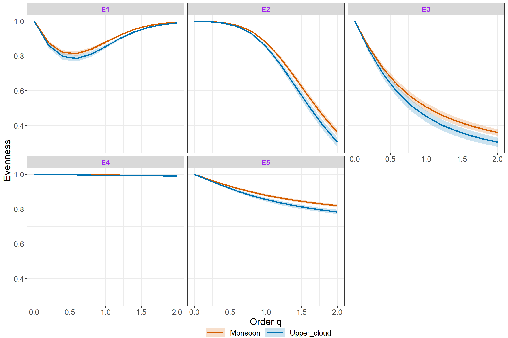

<!-- README.md is generated from README.Rmd. Please edit that file -->

# iNEXT.4steps (R package)

<h5 align="right">
Latest version: 2024-04-03
</h5>
<font color="394CAE">
<h3 color="394CAE" style="font-weight: bold">
Introduction to iNEXT.4steps (R package): Excerpt from iNEXT.4steps
User’s Guide
</h3>
</font> <br>
<h5>
<b>Anne Chao, Kai-Hsiang Hu</b> <br><br> <i>Institute of Statistics,
National Tsing Hua University, Hsin-Chu, Taiwan 30043</i>
</h5>

<br> `iNEXT.4steps` (Four-Step Biodiversity Analysis based on iNEXT)
expands `iNEXT` (Chao et al. 2014) to include the estimation of sample
completeness and evenness under a unified framework of Hill numbers.
`iNEXT.4steps` links sample completeness, diversity estimation,
interpolation and extrapolation (`iNEXT`), and evenness in a fully
integrated approach. The pertinent background for the four-step
methodology is provided in Chao et al. (2020). The four-step procedures
are described in the following:

-   **Step 1: Assessment of sample completeness profile**

Before performing biodiversity analysis, it is important to first
quantify the sample completeness of a biological survey. Chao et
al. (2020) generalized the conventional sample completeness to a class
of measures parametrized by an order q ≥ 0. When q = 0, sample
completeness reduces to the conventional measure of completeness, i.e.,
the ratio of the observed species richness to the true richness
(observed plus undetected). When q = 1, the measure reduces to the
sample coverage (the proportion of the total number of individuals in
the entire assemblage that belong to detected species), a concept
original developed by Alan Turing in his cryptographic analysis during
WWII. When q = 2, it represents a generalized sample coverage with each
species being proportionally weighted by its squared species abundance
(i.e., each individual being proportionally weighted by its species
abundance); this measure thus is disproportionally sensitive to highly
abundant species. For a general order q ≥ 0 (not necessarily to be an
integer) , the sample completeness of order q quantifies the proportion
of the assemblage’s individuals belonging to detected species, with each
individual being proportionally weighted by the (q-1)th power of its
abundance. Sample completeness profile depicts its estimate with respect
to order q ≥ 0; this profile fully characterizes the sample completeness
of a biological survey.

`iNEXT.4steps` features the estimated profile for all orders of q ≥ 0
based on the methodology developed in Chao et al. (2020). All estimates
are theoretically between 0 and 1. If the estimated sample completeness
profile is a horizontal line at the level of unity for all orders of q ≥
0, then the survey is complete, implying there is no undetected
diversity. In most applications, the estimated profile increases with
order q, revealing the existence of undetected diversity. The sample
completeness estimate for q = 0 provides an upper bound for the
proportion of observed species; its complement represents a lower bound
for the proportion of undetected species. This interpretation is mainly
because data typically do not contain sufficient information to
accurately estimate species richness and only a lower bound of species
richness can be well estimated. By contrast, for q ≥ 1, when data are
not sparse, the sample completeness value for q ≥ 1 can be very
accurately estimated measures. The values for q ≥ 2 typically are very
close to unity, signifying that almost all highly abundant species (for
abundance data) or highly frequent species (for incidence data) had been
detected in the reference sample.

-   **STEP 2. Analysis of the size-based rarefaction and extrapolation
    sampling curves, and the asymptotic diversity profile for 0 ≤ q ≤
    2.**

**(STEP 2a)**. For each dataset, first examine the pattern of the
size-based rarefaction and extrapolation sampling curve up to double the
reference sample size for q = 0, 1 and 2. If the curve stays at a fixed
level (this often occurs for the measures of q = 1 and 2), then our
asymptotic estimate presented in Step 2b can be used to accurately infer
the true diversity of the entire assemblage. Otherwise, our asymptotic
diversity estimate represents only a lower bound (this often occurs for
the measures of q = 0).

**(STEP 2b)**. When the true diversity can be accurately inferred, the
extent of undetected diversity within each dataset is obtained by
comparing the estimated asymptotic diversity profile and empirical
profile; the difference in diversity between any two assemblages can be
evaluated and tested for significance.

-   **STEP 3. Analysis of non-asymptotic coverage-based rarefaction and
    extrapolation analysis for orders q = 0, 1 and 2.**

When sampling data do not contain sufficient information to accurately
infer true diversity, fair comparisons of diversity across multiple
assemblages should be made by standardizing the sample coverage (i.e.,
comparing diversity for a standardized fraction of an assemblage’s
individuals). This comparison can be done based on seamless integration
of coverage-based rarefaction and extrapolation sampling curves up to a
maximum coverage (Cmax = the minimum sample coverage among all samples
extrapolated to double reference sizes).

-   **STEP 4. Assessment of evenness profiles**

Chao and Ricotta (2019) developed five classes of evenness measures
parameterized by an order q \> 0. (For q = 0, species abundances are
disregarded, so it is not meaningful to evaluate evenness among
abundances specifically for q = 0. As q tends to 0, all evenness values
tend to 1 as a limiting value.) All classes of evenness measures are
functions of diversity and species richness, and all are standardized to
the range of \[0, 1\] to adjust for the effect of differing species
richness. Evenness profile depicts evenness estimate with respect to
order q ≥ 0. Because true species richness typically cannot be
accurately estimated, evenness profile typically can only be accurately
measured when both diversity and richness are computed at a fixed level
of sample coverage up to a maximum coverage Cmax defined in Step 3.
`iNEXT.4steps` shows, by default, the relevant statistics and plot for
only one class of evenness measure (based on the normalized slope of a
diversity profile), but all the five classes are featured.

<span style="color:blue;">NOTE 1</span>: Sufficient data are required to
perform the 4-step analysis. If there are only a few species in users’
data, it is likely that data are too sparse to use `iNEXT.4steps.`

<span style="color:blue;">NOTE 2</span>: The analyses in STEPs 2a, 2b
and 3 are mainly based on package `iNEXT` available from CRAN. Thus,
`iNEXT.4steps` expands `iNEXT` to include the estimation of sample
completeness and evenness.

<span style="color:blue;">NOTE 3</span>: As with `iNEXT`, `iNEXT.4steps`
only deals with taxonomic/species diversity. Researchers who are
interested in phylogenetic diversity and functional diversity should use
package `iNEXT.3D` available from CRAN and see the relevant paper (Chao
et al. 2021) for methodology.

<span style="color:blue;">NOTE 4</span>: `iNEXT.4steps` aims to compare
within-assemblage diversity. If the goal is to assess the extent of
differentiation among assemblages or to infer species compositional
shift and abundance changes, users should use `iNEXT.beta3D` available
from CRAN and see the relevant paper (Chao et al. 2023) for methodology.

## How to cite

If you publish your work based on results from iNEXT.4steps package, you
should make references to the following methodology paper and the
package:

-   Chao, A., Kubota, Y., Zelený, D., Chiu, C.-H., Li, C.-F., Kusumoto,
    B., Yasuhara, M., Thorn, S., Wei, C.-L., Costello, M. J. and
    Colwell, R. K. (2020). Quantifying sample completeness and comparing
    diversities among assemblages. Ecological Research, 35, 292-314.

-   Chao, A. and Hu, K.-H. (2024). The iNEXT.4steps package: Four-Step
    Biodiversity Analysis based on iNEXT. R package available from CRAN.

## SOFTWARE NEEDED TO RUN iNEXT.4STEPS IN R

-   Required: [R](https://cran.r-project.org/)
-   Suggested: [RStudio
    IDE](https://posit.co/products/open-source/rstudio/#Desktop)

## HOW TO RUN INEXT.4STEPS:

The `iNEXT.4steps` package can be downloaded from CRAN or Anne Chao’s
[iNEXT.4steps_github](https://github.com/AnneChao/iNEXT.4steps). For a
first-time installation, some additional packages must be installed and
loaded; see package manual.

``` r
## install iNEXT.4steps package from CRAN
install.packages("iNEXT.4steps")

## install the latest version from github
install.packages('devtools')
library(devtools)
install_github('AnneChao/iNEXT.4steps')

## import packages
library(iNEXT.4steps)
```

An online version of iNEXT.4steps
(<https://chao.shinyapps.io/iNEXT_4steps/>) is also available for users
without an R background.

## <span style="color:red;">DATA INPUT FORMAT</span>

### Species abundance/incidence data format

For `iNEXT.4steps` package, pertinent information on species identity
(or any unique identification code) and assemblage affiliation is
required to be included in the input data for running iNEXT.4steps,
although species identity information is not taken into account in
inferring and comparing taxonomic/species diversity. Two types of
species taxonomic data are supported:

1.  Individual-based abundance data (`datatype = "abundance"`): When
    there are multiple assemblages, in addition to the assemblage/site
    names (as column names) and the species names (as row names),
    species abundance data (reference sample) can be input as a species
    (in rows) by assemblage (in columns) matrix/data.frame or a list of
    species abundance vectors. In the special case that there is only
    one assemblage, all data should be read in one column.

2.  Sampling-unit-based incidence data, i.e., Incidence or occurrence
    data (`datatype = "incidence_raw"`): for each assemblage, input data
    for a reference sample consist of a species-by-sampling-unit matrix,
    in addition to the sampling-unit names (as column names) and the
    species names (as row names). When there are N assemblages, input
    data consist of N lists of matrices, and each matrix is a
    species-by-sampling-unit matrix. Each element in the incidence raw
    matrix is 1 for a detection, and 0 for a non-detection. Input a
    matrix which combines data for all assemblages is allowed, but the
    argument `nT` must be specified to indicate the number of sampling
    units in each assemblage.

For example, the dataset `Data_spider` included in the `iNEXT.4steps`
package consists of species sample abundances of two assemblages/sites:
“Open” and “Closed”. Run the following code to view the data (only the
first 15 rows are shown below).

``` r
data("Data_spider")
Data_spider
```

                             Open Closed
    Pardosa_lugubris          350     10
    Alopecosa_taeniata        325     55
    Coelotes_terrestris       237    502
    Pardosa_riparia           102      1
    Haplodrassus_signifer      91      3
    Gnaphosa_badia             72      4
    Callobius_claustrarius     68    171
    Harpactea_lepida           61    140
    Tenuiphantes_tenebricola   53    180
    Cybaeus_angustiarum        50     24
    Inermocoelotes_inermis     50     76
    Pardosa_ferruginea         37     10
    Histopona_torpida          30     28
    Xerolycosa_nemoralis       29      0
    Amaurobius_fenestralis     17     35

We use incidence raw data (`Data_woody_plant`) collected from two sites,
`"Monsoon"` and `"Upper_cloud"`, as an example. Run the following code
to view the data (only the first 6 rows and first 3 columns for each
site are shown below).

``` r
data("Data_woody_plant")
Data_woody_plant
```

    $Monsoon
                                               Monsoon_unit_1 Monsoon_unit_2 Monsoon_unit_3
    Acacia_confusa_Merr.                                    0              0              0
    Acer_kawakamii_Koidzumi                                 0              0              0
    Acer_morrisonense_Hayata                                0              0              0
    Acer_serrulatum_Hayata                                  0              0              0
    Actinidia_chinensis_Planch._var._setosa_Li              0              0              0
    Adinandra_formosana_Hayata                              0              1              0

    $Upper_cloud
                                           Cloud_unit_1 Cloud_unit_2 Cloud_unit_3
    Abelia_chinensis_R._Br._var._ionandra             0            0            0
    Abies_kawakamii_(Hayata)_Ito                      0            0            0
    Acer_albopurpurascens_Hayata                      0            0            0
    Acer_kawakamii_Koidzumi                           0            0            0
    Acer_morrisonense_Hayata                          0            1            0
    Acer_palmatum_Thunb._var._pubescens_Li            0            0            0

## <span style="color:red;">MAIN FUNCTION iNEXT4steps()</span>

We first describe the main function `iNEXT4steps()` with default
arguments:

``` r
iNEXT4steps(data, q = seq(0, 2, 0.2), datatype = "abundance", 
            nboot = 30, conf = 0.95, nT = NULL, details = FALSE)
```

The arguments of this function are briefly described below, and will
explain details by illustrative examples in later text.

<table class='gmisc_table' style='border-collapse: collapse; margin-top: 1em; margin-bottom: 1em;' >
<thead>
<tr>
<th style="font-weight: 900; border-bottom: 1px solid grey; border-top: 2px solid grey; text-align: center;">
Argument
</th>
<th style="font-weight: 900; border-bottom: 1px solid grey; border-top: 2px solid grey; text-align: center;">
Description
</th>
</tr>
</thead>
<tbody>
<tr>
<td style="text-align: left;">
data
</td>
<td style='text-align: left;'>

1.  For <code>datatype = ‘abundance’</code>, data can be input as a
    vector of species abundances (for a single assemblage),
    matrix/data.frame (species by assemblages), or a list of species
    abundance vectors.
2.  For <code>datatype = ‘incidence_raw’</code>, data can be input as a
    list of matrix/data.frame (species by sampling units); data can also
    be input as a matrix/data.frame by merging all sampling units across
    assemblages based on species identity; in this case, the number of
    sampling units (nT, see below) must be input.
    </td>
    </tr>
    <tr>
    <td style="text-align: left;">
    q
    </td>
    <td style="text-align: left;">
    a numerical vector specifying the orders of q that will be used to
    compute sample completeness and evenness as well as plot the
    relevant profiles. Default is <code>seq(0, 2, by = 0.2)</code>.
    </td>
    </tr>
    <tr>
    <td style="text-align: left;">
    datatype
    </td>
    <td style="text-align: left;">
    data type of input data: individual-based abundance data
    (<code>datatype = ‘abundance’</code>) or species by sampling-units
    incidence matrix (<code>datatype = ‘incidence_raw’</code>) with all
    entries being 0 (non-detection) or 1 (detection)
    </td>
    </tr>
    <tr>
    <td style="text-align: left;">
    nboot
    </td>
    <td style="text-align: left;">
    a positive integer specifying the number of bootstrap replications
    when assessing sampling uncertainty and constructing confidence
    intervals. Enter 0 to skip the bootstrap procedures. Default is 30.
    </td>
    </tr>
    <tr>
    <td style="text-align: left;">
    conf
    </td>
    <td style="text-align: left;">
    a positive number \< 1 specifying the level of confidence interval.
    Default is 0.95.
    </td>
    </tr>
    <tr>
    <td style="text-align: left;">
    nT
    </td>
    <td style="text-align: left;">
    (required only when <code>datatype = ‘incidence_raw’</code> and
    input data in a single matrix/data.frame) a vector of positive
    integers specifying the number of sampling units in each assemblage.
    If assemblage names are not specified (i.e., <code>names(nT) =
    NULL</code>), then assemblages are automatically named as
    ‘Assemblage1’, ‘Assemblage2’,…, etc.
    </td>
    </tr>
    <tr>
    <td style="border-bottom: 2px solid grey; text-align: left;">
    details
    </td>
    <td style="border-bottom: 2px solid grey; text-align: left;">
    a logical variable to indicate whether the detailed numerical values
    for each step are displayed. Default is <code>FALSE</code>.
    </td>
    </tr>
    </tbody>
    </table>

The output of `iNEXT4steps` will have three parts (if `details = TRUE`):
`$summary`, `$figure`, and `$details`. It may take some time to compute
when data size is large or `nboot` is large.

## <span style="color:blue;">iNEXT.4steps VIA EXAMPLES</span>

First, we use the data `Data_spider` to illustrate the complete 4-step
analysis.

### EXAMPLE 1: Complete 4 steps for abundance data

In the spider data, species abundances of epigeal spiders were recorded
in two forest stands (“closed” and “open”). In the open forest, there
were 1760 individuals representing 74 species, whereas in the closed
forest, there were 1411 individuals representing 44 species. In the
pooled habitat, a total of 3171 individuals belonging to 85 species are
recorded.

Run the following code to obtain the numerical output and six figures
including five individual figures (for STEPs 1, 2a, 2b, 3 and 4,
respectively) and a complete set of five plots. (Here only show the
complete set of five plot; all five individual plots are omitted.)

``` r
data(Data_spider)
Four_Steps_out1 <- iNEXT4steps(data = Data_spider, datatype = "abundance")
Four_Steps_out1$summary
$`STEP 1. Sample completeness profiles`
  Assemblage q = 0 q = 1 q = 2
1     Closed  0.61  0.99     1
2       Open  0.77  0.99     1

$`STEP 2b. Observed diversity values and asymptotic estimates`
  Assemblage               qTD TD_obs TD_asy  s.e. qTD.LCL qTD.UCL
1     Closed  Species richness  44.00  72.11 17.17   38.45  105.76
2     Closed Shannon diversity  10.04  10.30  0.34    9.64   10.97
3     Closed Simpson diversity   5.71   5.73  0.24    5.26    6.19
4       Open  Species richness  74.00  96.31 12.56   71.69  120.93
5       Open Shannon diversity  16.34  16.84  0.55   15.77   17.91
6       Open Simpson diversity   9.41   9.46  0.31    8.85   10.07

$`STEP 3. Non-asymptotic coverage-based rarefaction and extrapolation analysis`
  Cmax = 0.994 q = 0 q = 1 q = 2
1       Closed  55.6  10.2  5.72
2         Open  86.5  16.6  9.43

$`STEP 4. Evenness among species abundances of orders q = 1 and 2 at Cmax based on the normalized slope of a diversity profile`
  Cmax = 0.994 Pielou J' q = 1 q = 2
1       Closed      0.58  0.17  0.09
2         Open      0.63  0.18  0.10
Four_Steps_out1$figure[[6]]
```


`$summary`: numerical tables for STEPs 1, 2b, 3 and 4.

-   `Assemblage` = the assemblage names.
-   `qTD` = ‘Species richness’ represents the taxonomic diversity of
    order q=0; ‘Shannon diversity’ represents the taxonomic diversity of
    order q=1, ‘Simpson diversity’ represents the taxonomic diversity of
    order q=2.
-   `TD_obs` = the observed taxonomic diversity value of order q.
-   `TD_asy` = the estimated asymptotic diversity value of order q.
-   `s.e.` = the bootstrap standard error of the estimated asymptotic
    diversity of order q.
-   `qTD.LCL`, `qTD.UCL` = the bootstrap lower and upper confidence
    limits for the estimated asymptotic diversity of order q at the
    specified level in the setting (with a default value of 0.95).
-   `Pielou J'` = a widely used evenness measure based on Shannon
    entropy.

`$figure`: six figures including five individual figures (for STEPS 1,
2a, 2b, 3 and 4 respectively) and a complete set of five plots.

`$details`: (only when `details = TRUE`). The numerical output for
plotting all figures.

### EXAMPLE 2: Complete 4 steps for incidence data

In the “Woody_plant” data, species incidence-raw data were recorded in
two forest vegetation types (“Monsoon” and “Upper_cloud” forest). In the
monsoon forest, 329 species and 6814 incidences were recorded in 191
plots. In the upper cloud forest, 239 species and 3371 incidences were
recorded in 153 plots (each 20×20-m plot is regarded as a sampling
unit). Because spatial clustering prevails in woody plants, individual
plants cannot be regarded as independent sampling units, violating the
basic sampling assumptions for the model based on abundance data. Thus,
it is statistically preferable to use incidence data to avoid this
violation.

Run the following code to obtain the numerical output and six figures
including five individual figures (for STEPs 1, 2a, 2b, 3 and 4,
respectively) and a complete set of five plots. (Here only show the
complete set of five plot; all five individual plots are omitted.)

``` r
data(Data_woody_plant)
Four_Steps_out2 <- iNEXT4steps(data = Data_woody_plant, datatype = "incidence_raw")
Four_Steps_out2$summary
$`STEP 1. Sample completeness profiles`
   Assemblage q = 0 q = 1 q = 2
1     Monsoon  0.78  0.99     1
2 Upper_cloud  0.78  0.98     1

$`STEP 2b. Observed diversity values and asymptotic estimates`
   Assemblage               qTD TD_obs TD_asy  s.e. qTD.LCL qTD.UCL
1     Monsoon  Species richness  329.0  421.7 22.90   376.8   466.6
2     Monsoon Shannon diversity  145.7  150.2  1.59   147.0   153.3
3     Monsoon Simpson diversity  102.3  103.3  1.03   101.3   105.4
4 Upper_cloud  Species richness  239.0  307.8 17.97   272.6   343.0
5 Upper_cloud Shannon diversity  105.5  110.5  1.69   107.2   113.8
6 Upper_cloud Simpson diversity   71.2   72.2  1.29    69.7    74.8

$`STEP 3. Non-asymptotic coverage-based rarefaction and extrapolation analysis`
  Cmax = 0.993 q = 0 q = 1 q = 2
1      Monsoon   360   147 102.7
2  Upper_cloud   279   109  71.7

$`STEP 4. Evenness among species abundances of orders q = 1 and 2 at Cmax based on the normalized slope of a diversity profile`
  Cmax = 0.993 Pielou J' q = 1 q = 2
1      Monsoon      0.85  0.41  0.28
2  Upper_cloud      0.83  0.39  0.25
Four_Steps_out2$figure[[6]]
```


## <span style="color:red;">Completeness and ggCompleteness: MAIN FUNCTIONS FOR STEP 1</span>

Function `Completeness()` computes sample completeness estimates of
orders q = 0 to q = 2 in increments of 0.2 (by default), and function
`ggCompleteness` is used to plot the corresponding sample completeness
profiles. These two functions are specifically for users who only
require sample completeness estimates and profiles. The two functions
with arguments are described below:

``` r
Completeness(data, q = seq(0, 2, 0.2), datatype = "abundance", nboot = 30, 
             conf = 0.95, nT = NULL)
```

``` r
ggCompleteness(output)
```

All the arguments in these two functions are the same as those in the
main fnction `iNEXT4steps` for details.

### Sample completeness estimates and profiles for abundance data

Run the following code to obtain sample completeness estimates based on
the abundance data `Data_spider`:

``` r
data(Data_spider)
SC_out1 <- Completeness(data = Data_spider, datatype = "abundance")
SC_out1
   Order.q Estimate.SC     s.e. SC.LCL SC.UCL Assemblage
1      0.0       0.768 8.89e-02  0.594  0.943       Open
2      0.2       0.818 6.49e-02  0.691  0.945       Open
3      0.4       0.877 3.89e-02  0.801  0.953       Open
4      0.6       0.930 1.85e-02  0.894  0.966       Open
5      0.8       0.966 7.12e-03  0.953  0.980       Open
6      1.0       0.986 2.38e-03  0.981  0.990       Open
7      1.2       0.994 7.56e-04  0.993  0.996       Open
8      1.4       0.998 2.61e-04  0.997  0.998       Open
9      1.6       0.999 1.05e-04  0.999  0.999       Open
10     1.8       1.000 4.59e-05  1.000  1.000       Open
11     2.0       1.000 2.01e-05  1.000  1.000       Open
12     0.0       0.610 1.31e-01  0.353  0.867     Closed
13     0.2       0.718 9.83e-02  0.526  0.911     Closed
14     0.4       0.834 5.69e-02  0.722  0.945     Closed
15     0.6       0.922 2.43e-02  0.874  0.969     Closed
16     0.8       0.969 8.18e-03  0.953  0.985     Closed
17     1.0       0.989 2.43e-03  0.985  0.994     Closed
18     1.2       0.997 7.21e-04  0.995  0.998     Closed
19     1.4       0.999 2.35e-04  0.999  0.999     Closed
20     1.6       1.000 8.37e-05  1.000  1.000     Closed
21     1.8       1.000 3.08e-05  1.000  1.000     Closed
22     2.0       1.000 1.12e-05  1.000  1.000     Closed
```

-   `Order.q`: the order of sample completeness.
-   `Estimate.SC`: the estimated sample completeness of order q.
-   `s.e.`: standard error of sample completeness estimate.
-   `SC.LCL`, `SC.UCL`: the bootstrap lower and upper confidence limits
    for the sample completeness of order q at the specified level (with
    a default value of 0.95).
-   `Assemblage`: the assemblage name.

Run the following code to plot sample completeness profiles for q
between 0 to 2, along with confidence intervals.

``` r
ggCompleteness(SC_out1)
```


### Sample completeness estimates and profiles for incidence data

Similar procedures can be applied to incidence data `Data_woody_plant`
to infer sample completeness.

``` r
data(Data_woody_plant)
SC_out2 <- Completeness(data = Data_woody_plant, datatype = "incidence_raw")
SC_out2
   Order.q Estimate.SC     s.e. SC.LCL SC.UCL  Assemblage
1      0.0       0.780 4.25e-02  0.697  0.864     Monsoon
2      0.2       0.849 2.76e-02  0.795  0.903     Monsoon
3      0.4       0.909 1.52e-02  0.879  0.938     Monsoon
4      0.6       0.951 7.12e-03  0.937  0.965     Monsoon
5      0.8       0.976 2.93e-03  0.970  0.982     Monsoon
6      1.0       0.989 1.11e-03  0.987  0.991     Monsoon
7      1.2       0.995 4.20e-04  0.994  0.996     Monsoon
8      1.4       0.998 1.84e-04  0.998  0.998     Monsoon
9      1.6       0.999 9.49e-05  0.999  0.999     Monsoon
10     1.8       1.000 5.13e-05  1.000  1.000     Monsoon
11     2.0       1.000 2.70e-05  1.000  1.000     Monsoon
12     0.0       0.777 4.07e-02  0.697  0.856 Upper_cloud
13     0.2       0.836 2.81e-02  0.781  0.891 Upper_cloud
14     0.4       0.892 1.66e-02  0.859  0.924 Upper_cloud
15     0.6       0.935 8.47e-03  0.919  0.952 Upper_cloud
16     0.8       0.965 3.78e-03  0.958  0.972 Upper_cloud
17     1.0       0.982 1.55e-03  0.979  0.985 Upper_cloud
18     1.2       0.992 6.56e-04  0.990  0.993 Upper_cloud
19     1.4       0.996 3.25e-04  0.995  0.997 Upper_cloud
20     1.6       0.998 1.83e-04  0.998  0.999 Upper_cloud
21     1.8       0.999 1.05e-04  0.999  0.999 Upper_cloud
22     2.0       1.000 5.79e-05  1.000  1.000 Upper_cloud
```

Run the following code to plot sample completeness profiles for q
between 0 to 2, along with confidence intervals.

``` r
ggCompleteness(SC_out2)
```


## <span style="color:red;">Evenness and ggevenness: MAIN FUNCTIONS FOR STEP 4</span>

`Evenness()` computes standardized (or observed) evenness of order q = 0
to q = 2 in increments of 0.2 (by default) based on five classes of
evenness measures, and function `ggevenness` is used to plot the
corresponding evenness profiles. These two functions are specifically
for users who only require evenness estimates and profiles. The two
functions with arguments are described below:

``` r
Evenness(data, q = seq(0, 2, 0.2), datatype = "abundance", method = "Estimated",
         nboot = 30, conf = 0.95, nT = NULL, E.class = 1:5, SC = NULL)
```

``` r
ggEvenness(output)
```

There are only three arguments that are not used in the main function
`iNEXT4steps`; these three arguments are described below (see
`iNEXT4steps` for other arguments)

<table class="gmisc_table" style="border-collapse: collapse; margin-top: 1em; margin-bottom: 1em;">
<thead>
<tr>
<th style="font-weight: 900; border-bottom: 1px solid grey; border-top: 2px solid grey; text-align: center;">
Argument
</th>
<th style="font-weight: 900; border-bottom: 1px solid grey; border-top: 2px solid grey; text-align: center;">
Description
</th>
</tr>
</thead>
<tbody>
<tr>
<td style="text-align: left;">
method
</td>
<td style="text-align: left;">
a binary selection of method with <code>‘Estimated’</code> (evenness is
computed under a standardized coverage value) or <code>‘Observed’</code>
(evenness is computed for the observed data).
</td>
</tr>
<tr>
<td style="text-align: left;">
E.class
</td>
<td style="text-align: left;">
an integer vector between 1 to 5 specifying which class(es) of evenness
measures are selected; default is 1:5 (select all five classes).
</td>
</tr>
<tr>
<td style="border-bottom: 2px solid grey; text-align: left;">
SC
</td>
<td style="border-bottom: 2px solid grey; text-align: left;">
(required only when <code>method = ‘Estimated’</code>) a standardized
coverage value for calculating estimated evenness. If
<code>SC=NULL</code>, then this function computes the diversity
estimates for the minimum sample coverage among all samples extrapolated
to double reference sizes (Cmax).
</td>
</tr>
</tbody>
</table>

Two simple examples for demonstrating functions `Evenness` and
`ggEvenness` are given below.

### Evenness estimates and profiles for abundance data with default standardized coverage value (Cmax)

The dataset `Data_spider` is used to estimate evenness at the default
standardized sample coverage (`SC = NULL`). Evenness estimates of order
q = 0 to q = 2 in increments of 0.2 (by default) will be computed based
on five classes of evenness measures. (For q = 0, species abundances are
disregarded, so it is not meaningful to evaluate evenness among
abundances specifically for q = 0. As q tends to 0, all evenness values
tend to 1 as a limiting value.) Function `ggevenness` is used to plot
the corresponding evenness profiles. Here only the evenness estimates
are shown for the first class of evenness measures. The corresponding
numerical tables for the other four classes of evenness measures are
omitted. Users also can use argument `E.class` to specify which class
(e.g., `E.class= 3`) or classes are required.

``` r
data(Data_spider)
Even_out1_est <- Evenness(data = Data_spider, datatype = "abundance", 
                          method = "Estimated", SC = NULL, E.class = 1:5)
Even_out1_est
```

    $E1
       Order.q Evenness    s.e. Even.LCL Even.UCL Assemblage    Method    SC
    1      0.0    1.000 0.00000    1.000    1.000       Open Estimated 0.994
    2      0.2    0.728 0.02257    0.683    0.772       Open Estimated 0.994
    3      0.4    0.601 0.02916    0.544    0.658       Open Estimated 0.994
    4      0.6    0.563 0.02886    0.506    0.619       Open Estimated 0.994
    5      0.8    0.580 0.02537    0.530    0.630       Open Estimated 0.994
    6      1.0    0.630 0.02043    0.590    0.670       Open Estimated 0.994
    7      1.2    0.694 0.01528    0.664    0.724       Open Estimated 0.994
    8      1.4    0.760 0.01083    0.739    0.781       Open Estimated 0.994
    9      1.6    0.819 0.00751    0.804    0.834       Open Estimated 0.994
    10     1.8    0.867 0.00530    0.857    0.878       Open Estimated 0.994
    11     2.0    0.904 0.00390    0.897    0.912       Open Estimated 0.994
    12     0.0    1.000 0.00000    1.000    1.000     Closed Estimated 0.994
    13     0.2    0.700 0.03053    0.640    0.759     Closed Estimated 0.994
    14     0.4    0.567 0.03952    0.489    0.644     Closed Estimated 0.994
    15     0.6    0.525 0.03938    0.448    0.603     Closed Estimated 0.994
    16     0.8    0.537 0.03500    0.468    0.605     Closed Estimated 0.994
    17     1.0    0.578 0.02870    0.521    0.634     Closed Estimated 0.994
    18     1.2    0.633 0.02204    0.590    0.676     Closed Estimated 0.994
    19     1.4    0.693 0.01620    0.661    0.724     Closed Estimated 0.994
    20     1.6    0.749 0.01185    0.726    0.772     Closed Estimated 0.994
    21     1.8    0.799 0.00905    0.781    0.817     Closed Estimated 0.994
    22     2.0    0.840 0.00742    0.826    0.855     Closed Estimated 0.994

-   `Order.q`: the order of evenness.
-   `Evenness`: the computed evenness value of order q.
-   `s.e.`: standard error of evenness value.
-   `Even.LCL`, `Even.UCL`: the bootstrap lower and upper confidence
    limits for the evenness of order q at the specified level (with a
    default value of `0.95`).
-   `Assemblage`: the assemblage name.
-   `Method`: `"Estimated"` or `"Observed"`.
-   `SC`: the standardized coverage value under which evenness values
    are computed (only for `method = "Estimated"`)

The following commands plot the evenness profiles for all five classes
of even measures, along with their confidence intervals.

``` r
ggEvenness(Even_out1_est)
```


### Evenness estimates and profiles for incidence data with user’s specified coverage value of 0.98.

In the function `Evenness`, users can specify a particular sample
coverage value under which all five classes of evenness measures will be
computed. For example, instead of using the default standardized
coverage value, if users want to compute evenness estimates for 0.98
based on the incidence dataset `Data_woody_plant`, then the argument
`SC=0.98` is used instead of `SC=NULL`, as shown below. Here only the
evenness estimates are displayed for the first class of evenness
measures. The corresponding numerical tables for the other four classes
of evenness measures are omitted.

``` r
data(Data_woody_plant)
Even_out2_est <- Evenness(data = Data_woody_plant, datatype = "incidence_raw", 
                          method = "Estimated", SC = 0.98, E.class = 1:5)
Even_out2_est
```

    $E1
       Order.q Evenness     s.e. Even.LCL Even.UCL  Assemblage    Method   SC
    1      0.0    1.000 0.000000    1.000    1.000     Monsoon Estimated 0.98
    2      0.2    0.876 0.004796    0.866    0.885     Monsoon Estimated 0.98
    3      0.4    0.821 0.006472    0.808    0.833     Monsoon Estimated 0.98
    4      0.6    0.814 0.006299    0.802    0.827     Monsoon Estimated 0.98
    5      0.8    0.839 0.005098    0.829    0.849     Monsoon Estimated 0.98
    6      1.0    0.880 0.003523    0.873    0.887     Monsoon Estimated 0.98
    7      1.2    0.921 0.002097    0.917    0.925     Monsoon Estimated 0.98
    8      1.4    0.953 0.001094    0.951    0.955     Monsoon Estimated 0.98
    9      1.6    0.975 0.000516    0.973    0.976     Monsoon Estimated 0.98
    10     1.8    0.987 0.000230    0.987    0.987     Monsoon Estimated 0.98
    11     2.0    0.994 0.000102    0.993    0.994     Monsoon Estimated 0.98
    12     0.0    1.000 0.000000    1.000    1.000 Upper_cloud Estimated 0.98
    13     0.2    0.861 0.006899    0.847    0.874 Upper_cloud Estimated 0.98
    14     0.4    0.797 0.009336    0.779    0.815 Upper_cloud Estimated 0.98
    15     0.6    0.787 0.009218    0.769    0.805 Upper_cloud Estimated 0.98
    16     0.8    0.812 0.007673    0.797    0.827 Upper_cloud Estimated 0.98
    17     1.0    0.855 0.005545    0.844    0.866 Upper_cloud Estimated 0.98
    18     1.2    0.901 0.003520    0.894    0.908 Upper_cloud Estimated 0.98
    19     1.4    0.939 0.002001    0.935    0.942 Upper_cloud Estimated 0.98
    20     1.6    0.965 0.001052    0.963    0.967 Upper_cloud Estimated 0.98
    21     1.8    0.981 0.000531    0.980    0.982 Upper_cloud Estimated 0.98
    22     2.0    0.990 0.000266    0.990    0.991 Upper_cloud Estimated 0.98

The following commands plot the evenness profiles for five classes,
along with their confidence intervals.

``` r
ggEvenness(Even_out2_est)
```



## License

The iNEXT.4steps package is licensed under the GPLv3. To help refine
`iNEXT.4steps`, your comments or feedback would be welcome (please send
them to Anne Chao or report an issue on the iNEXT.4steps github
[iNEXT.4steps_github](https://github.com/AnneChao/iNEXT.4steps).

## References

-   Chao, A., Gotelli, N. G., Hsieh, T. C., Sander, E. L., Ma, K. H.,
    Colwell, R. K. and Ellison, A. M. (2014). Rarefaction and
    extrapolation with Hill numbers: a framework for sampling and
    estimation in species biodiversity studies. Ecological Monographs
    84, 45-67.

-   Chao, A., Henderson, P. A., Chiu, C.-H., Moyes, F., Hu, K.-H.,
    Dornelas, M and Magurran, A. E. (2021). Measuring temporal change in
    alpha diversity: a framework integrating taxonomic, phylogenetic and
    functional diversity and the iNEXT.3D standardization. Methods in
    Ecology and Evolution, 12, 1926-1940.

-   Chao, A., Kubota, Y., Zelený, D., Chiu, C.-H., Li, C.-F., Kusumoto,
    B., Yasuhara, M., Thorn, S., Wei, C.-L., Costello, M. J. and
    Colwell, R. K. (2020). Quantifying sample completeness and comparing
    diversities among assemblages. Ecological Research, 35, 292-314.

-   Chao, A. and Ricotta, C. (2019). Quantifying evenness and linking it
    to diversity, beta diversity, and similarity. Ecology, 100(12),
    e02852.

-   Chao, A., Thorn, S., Chiu, C.-H., Moyes, F., Hu, K.-H., Chazdon, R.
    L., Wu, J., Magnago, L. F. S., Dornelas, M., Zelený, D., Colwell, R.
    K., and Magurran, A. E. (2023). Rarefaction and extrapolation with
    beta diversity under a framework of Hill numbers: the iNEXT.beta3D
    standardization. Ecological Monographs e1588.
