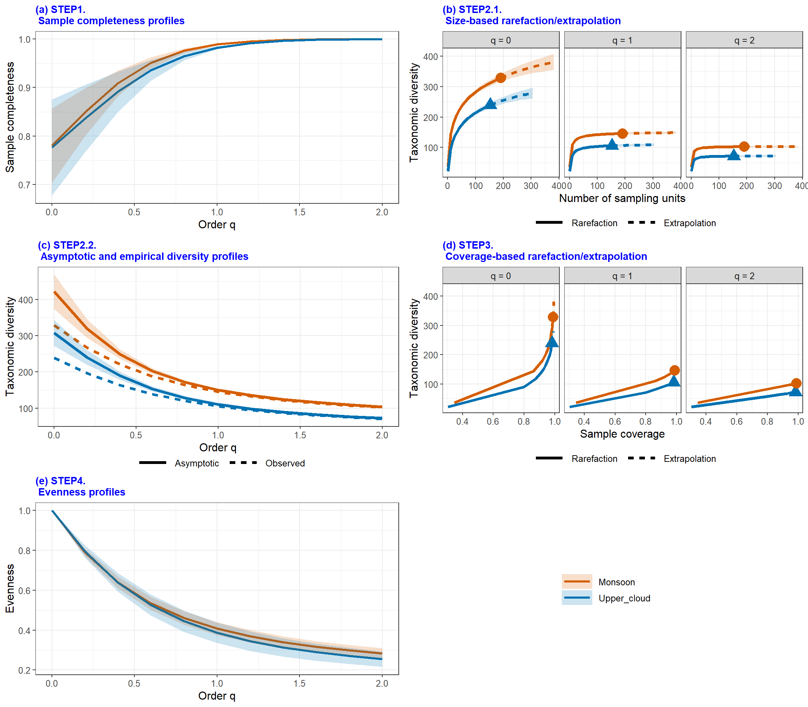
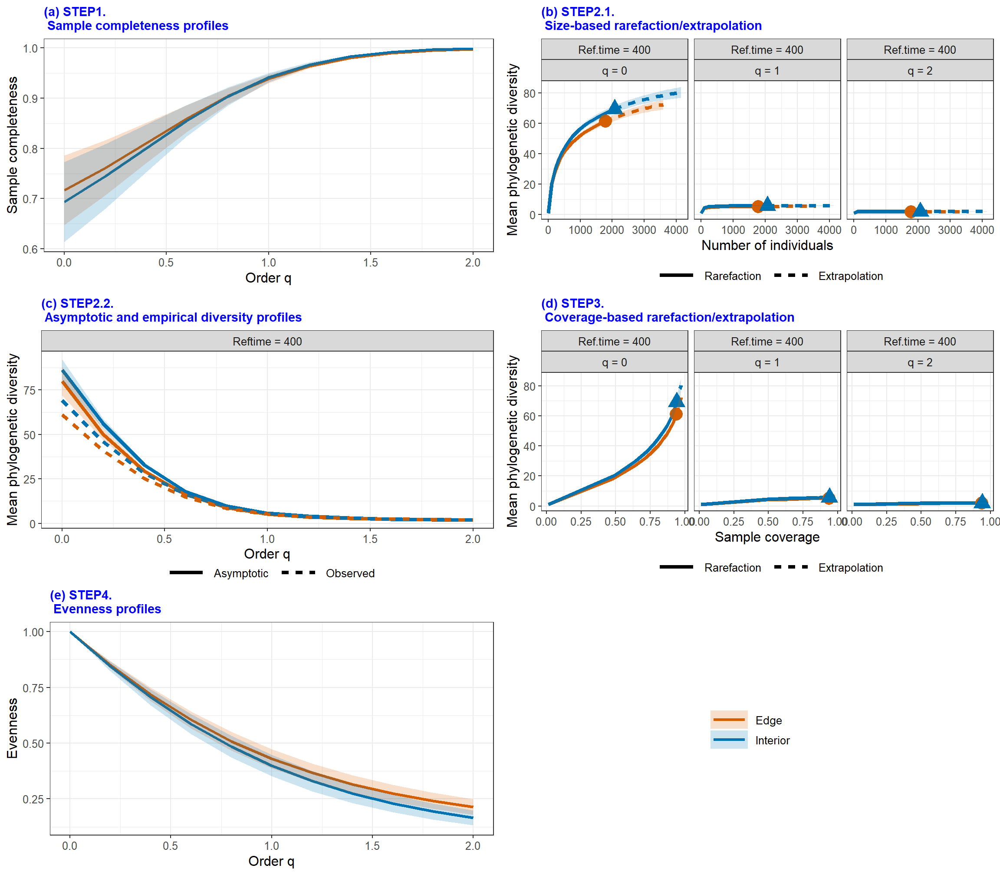
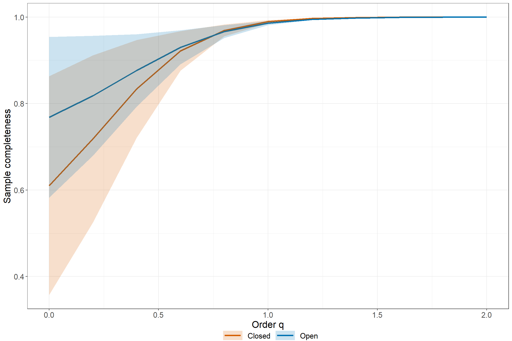
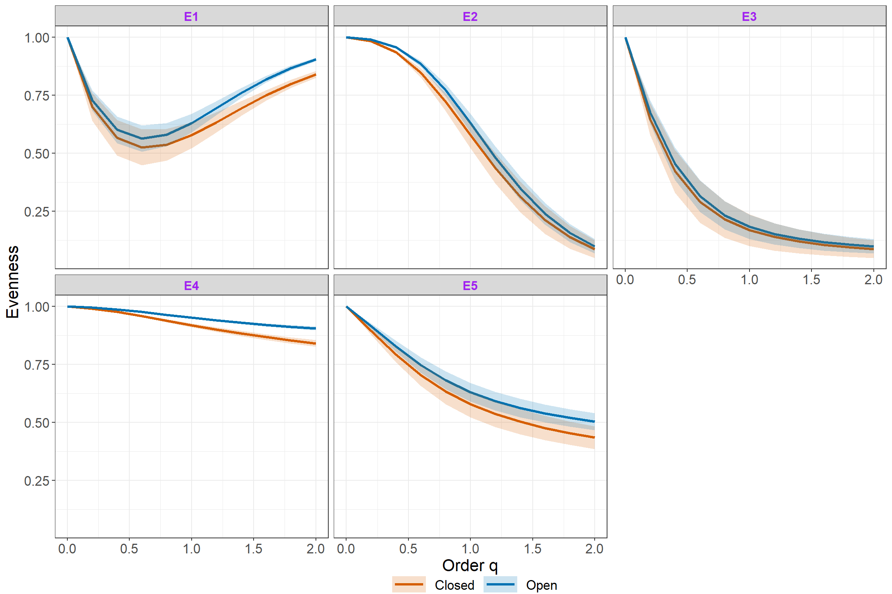
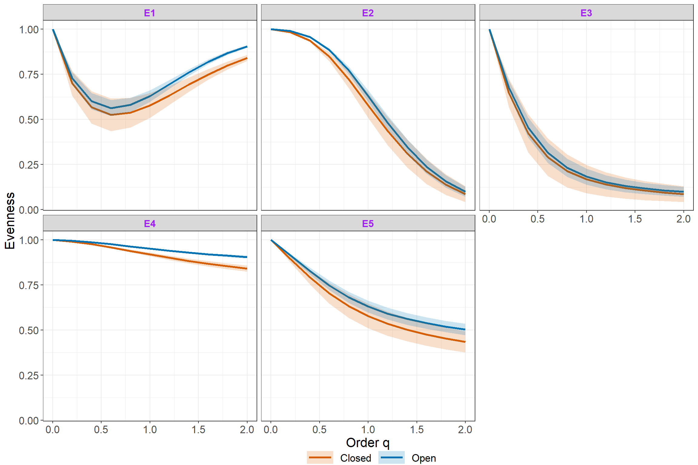
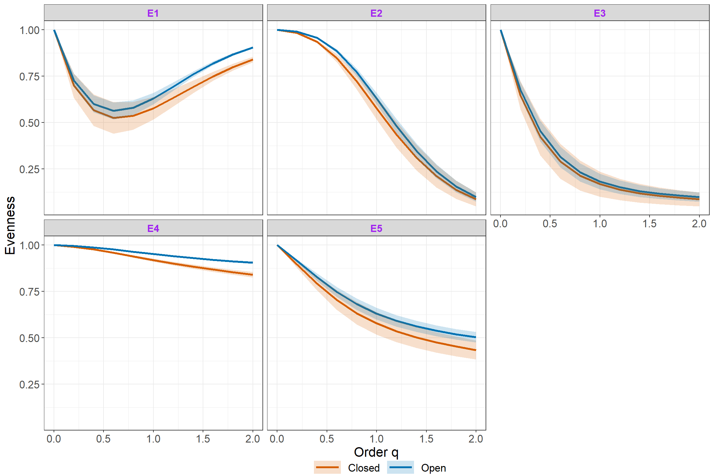
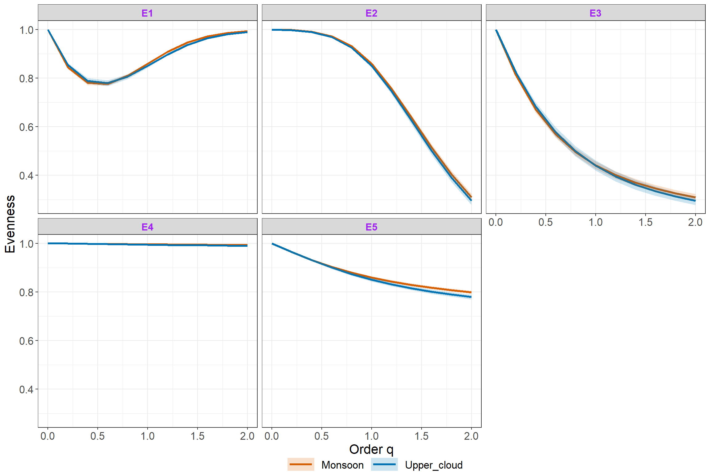
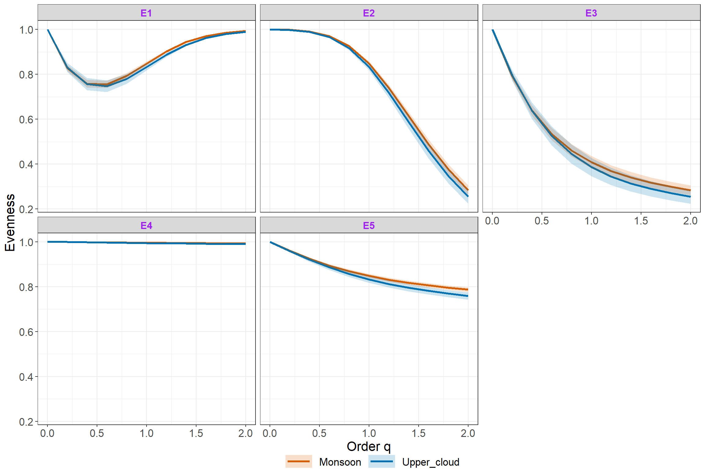

<!-- README.md is generated from README.Rmd. Please edit that file -->

# iNEXT.4steps (R package)

<h5 align="right">
Latest version: 2024-02-26
</h5>
<font color="394CAE">
<h3 color="394CAE" style="font-weight: bold">
Introduction to iNEXT.4steps (R package): Excerpt from iNEXT.4steps
User’s Guide
</h3>
</font> <br>
<h5>
<b>Anne Chao, Kai-Hsiang Hu</b> <br><br> <i>Institute of Statistics,
National Tsing Hua University, Hsin-Chu, Taiwan 30043</i>
</h5>

<br> `iNEXT.4steps` (iNterpolation and EXTrapolation for four steps of
biodiversity) is an original R package which provide an easy complete
biological analysis computation. In Chao et al. (2020) paper, they
proposed a complete biological analysis process:

-   `STEP1`. Sample completeness profiles.

-   `STEP2`. Size-based rarefaction and extrapolation analysis and the
    asymptotic diversity profile.

-   `STEP3`. Non-asymptotic coverage-based rarefaction and extrapolation
    analysis.

-   `STEP4`. Evenness among species abundances.

These are the compositions of `iNEXT.4steps`. Here we will also
introduce functions for `STEP1` and `STEP4`, particularly. If you want
to grasp the functions of `STEP2` or `STEP3` only, then please refer to
the package
[iNEXT.3D](https://cran.r-project.org/web/packages/iNEXT.3D/index.html)
from CRAN for more details. `iNEXT.3D` features two statistical analyses
(non-asymptotic and asymptotic):

1.  A non-asymptotic approach based on interpolation and extrapolation
    for 3D diversity (i.e., Hill-Chao numbers)

computes the estimated 3D diversity for standardized samples with a
common sample size or sample completeness. This approach aims to compare
diversity estimates for equally-large (with a common sample size) or
equally-complete (with a common sample coverage) samples; it is based on
the seamless rarefaction and extrapolation (R/E) sampling curves of
Hill-Chao numbers for q = 0, 1 and 2.

1.  An asymptotic approach to infer asymptotic 3D diversity (i.e.,
    Hill-Chao numbers)

`iNEXT.4steps` provides four functions for users to compute and
visualize sample completeness curves and evenness curves: `Completeness`
and `Evenness` for computation, and `ggCompleteness` and `ggEvenness`
for visualization. The most comprehensive function `iNEXT4steps` gathers
`iNEXT3D`, `AO3D`, `Completeness` and `Evenness` into a summary table
and a figure. In this document, we will give a quick introduction
demonstrating how to run these functions. Detailed information about
these function settings is provided in the `iNEXT.4steps` manual, which
will be submitted to \[CRAN\]. See Chao et al. (2020) to get more
details.

## How to cite

If you publish your work based on results from iNEXT.4steps package, you
should make references to the following methodology paper and the
package:

-   Chao, A., Y. Kubota, D. Zeleny, C.-H. Chiu, C.-F. Li, B.
    Kusumoto, M. Yasuhara, S. Thorn, C.-L. Wei, M. J. Costello,
    and R. K. Colwell (2020). Quantifying sample completeness and
    comparing diversities among assemblages. Ecological Research, 35,
    292-314.

## SOFTWARE NEEDED TO RUN INEXT IN R

-   Required: [R](https://cran.r-project.org/)
-   Suggested: [RStudio
    IDE](https://posit.co/products/open-source/rstudio/#Desktop)

## HOW TO RUN INEXT.4STEPS:

The `iNEXT.4steps` package will be submitted to \[CRAN\] or can be
downloaded from Anne Chao’s
[iNEXT.4steps_github](https://github.com/AnneChao/iNEXT.4steps). For a
first-time installation, some additional packages must be installed and
loaded; see package manual.

``` r
## install iNEXT.4steps package from CRAN
# install.packages("iNEXT.4steps")  # Coming soon

## install the latest version from github
install.packages('devtools')
library(devtools)
install_github('AnneChao/iNEXT.4steps')

## import packages
library(iNEXT.4steps)
```

An online version of iNEXT.4steps
(<https://chao.shinyapps.io/iNEXT_4steps/>) is also available for users
without R background.

## SIMPLE STEPS BRIEF

-   **Step 1: Sample completeness profile**

`Sample Completeness` represent the proportion of observed species in
the population (Chao et al., 2020). Usually, the sampling data
represents the abundant species in the population so that we will ignore
the rare species. Here we will use Turing’s sample coverage theory to
reconstruct the population proportion. Besides, sample completeness can
correspond to order q, which is an weight index. When order q tends to
zero, then we will give more weight to rare species. If order q tends to
unity, then we will equally treat each species, which is also called
sample coverage at unity. In contrast, if order q tends to larger than
unity, we will give more weights to abundant species. By sample
completeness, we can easily plot the estimated curve with respect to
order q and associated 95% confidence interval.

-   **Step 2.1 and step 3: Size-based and coverage-based Interpolation
    and Extrapolation**

`Interpolation and Extrapolation (iNEXT)` focuses on three measures of
order q: species richness (q = 0), Shannon diversity (q = 1, the
exponential of Shannon entropy), and Simpson diversity (q = 2, the
inverse of Simpson concentration) (Chao and Jost, 2012; Chao et
al. 2014). For each diversity measures, `iNEXT` uses observed sample to
compute expected diversity estimates and associated 95% confidence
intervals according two different unit types of rarefaction and
extrapolation (R/E):

1.  Sample-size-based R/E sampling curves versus diversity in each order
    q.

2.  Coverage-based R/E sampling curves versus diversity in each order q.

A unified framework based on Hill numbers (for TD) and their
generalizations (Hill-Chao numbers, for PD and FD) is adopted to
quantify 3D. In this framework, TD quantifies the effective number of
species, PD quantifies the effective total branch length, mean-PD (PD
divided by tree depth) quantifies the effective number of lineages, and
FD quantifies the effective number of virtual functional groups (or
functional “species”). Thus, TD, mean-PD, and FD are all in the same
units of species/lineage equivalents and can be meaningfully compared.
For more particular usage about `iNEXT.3D`, please refer to Chao et
al. (2021).

-   **Step 2.2: Asymptotic diversity profile**

`Asymptotic Diversity (or called Hill numbers)` computes the estimated
asymptotic 3D diversity and also plots 3D diversity profiles
(q-profiles) for q between 0 and 2, in comparison with the observed
diversity. Typically, the asymptotic estimates for q ≥ 1 are reliable,
but for q \< 1 (especially for q = 0, species richness), the asymptotic
estimates represent only lower bounds. `Asymptotic Diversity` also
features a time-profile (which depicts the observed and asymptotic
estimate of PD or mean PD with respect to reference times), and a
tau-profile (which depicts the observed and asymptotic estimate of FD
with respect to threshold level tau).

-   **Step 4: Evenness profile**

`Evenness` is an function to compute whether a assemblage is uniform or
not. There are five main classes according to different transformation
by species and diversity (Chao and Ricotta, 2019). In these five
classes, they all have range from zero to one. When the value reaches to
minimum (zero), it means that the assemblage tends to uneven. On the
contrary, when the value reaches to maximum (one), it means that the
assemblage tends to even. Evenness considers different order q under
each classes. When order q tends to zero, we will focus on rare species.
In other sides, when order q tends to far from zero, then we will give
more weights on abundant species. For each sampling data, it usually has
biase because of unobserved rare species. Here, we propose a
“standardized sample coverage” (default is `Cmax`, which means the
minimum sample coverage among all samples extrapolated to double
reference sizes) as a judged criterion. According to this criterion, we
can also plot the Evenness curves with order q and associated 95%
confidence interval.

## <span style="color:red;">DATA INPUT FORMAT</span>

### Species abundance/incidence data format

For `iNEXT.3D` package, information on species identity (or any unique
identification code) and assemblage affiliation is required for PD and
FD. Two types of species abundance/incidence data are supported:

1.  Individual-based abundance data (`datatype = "abundance"`): When
    there are multiple assemblages, in addition to the assemblage/site
    names (as column names) and the species names (as row names),
    species abundance data (reference sample) can be input as a species
    (in rows) by assemblage (in columns) matrix/data.frame or a list of
    species abundance vectors. In the special case that there is only
    one assemblage, all data should be read in one column.

2.  Sampling-unit-based incidence data: There are two kinds of input
    data.  

<!-- -->

1.  Sampling-unit-based incidence data: Incidence-raw data
    (`datatype = "incidence_raw"`): for each assemblage, input data for
    a reference sample consist of a species-by-sampling-unit matrix, in
    addition to the sampling-unit names (as column names) and the
    species names (as row names). When there are N assemblages, input
    data consist of N lists of matrices, and each matrix is a
    species-by-sampling-unit matrix. Each element in the incidence raw
    matrix is 1 for a detection, and 0 for a non-detection. Input a
    matrix which combines data for all assemblages is allowed, but the
    argument `nT` in the function `iNEXT3D` must be specified so that
    the number of sampling units in each assemblage is specified.

2.  Sampling-unit-based incidence-frequency data
    (`datatype = "incidence_freq"`): input data for each assemblage
    consist of species sample incidence frequencies (i.e., row sums of
    the corresponding incidence raw matrix). When there are N
    assemblages, input data consist of an (S+1) by N matrix, or N lists
    of species incidence frequencies. The first entry of each
    column/list must be the total number of sampling units, followed by
    the species incidence frequencies.

For example, the dataset `Brazil_abun_data` included in the `iNEXT.3D`
package consists of species sample abundances of two
assemblages/habitats: “Edge” and “Interior”. Run the following code to
view the first 15 rows of the abundance data.

``` r
data("Brazil_abun_data")
Brazil_abun_data
```

                             Edge Interior
    Carpotroche_brasiliensis   11       21
    Astronium_concinnum       110       11
    Astronium_graveolens       36        7
    Spondias_macrocarpa        12        1
    Spondias_venulosa           2        0
    Tapirira_guianensis         7        1
    Thyrsodium_spruceanum      11       11
    Anaxagorea_silvatica        1       13
    Annona_acutiflora           1        1
    Annona_cacans               0        2
    Annona_dolabripetala        3        3
    Annona_sp                   0        1
    Duguetia_chrysocarpa        1        1
    Ephedranthus_sp1            1        0
    Ephedranthus_sp2            0        1

We use incidence frequency data (`Woody_plants`) collected from four
sites, namely `"Upper_cloud"`, `"Lower_cloud"`, `"Lowland"`, and
`"Monsoon"`, as an example. Note that the first row of incidence
frequency data should be the total sampling units for each assemblage.
Run the following code to view the first 16 rows and first 2 columns of
the incidence frequency data.

``` r
data("Woody_plants")
Woody_plants
```

                                                                          Upper_cloud Lower_cloud
    plots                                                                         153         203
    Abelia_chinensis_R._Br._var._ionandra_(Hayata)_Masam.                           1           0
    Abies_kawakamii_(Hayata)_Ito                                                    2           1
    Acacia_confusa_Merr.                                                            0           0
    Acer_albopurpurascens_Hayata                                                    1           2
    Acer_kawakamii_Koidzumi                                                         7          36
    Acer_morrisonense_Hayata                                                       25          25
    Acer_palmatum_Thunb._var._pubescens_Li                                         12           1
    Acer_serrulatum_Hayata                                                          6          26
    Actinidia_chinensis_Planch._var._setosa_Li                                      0           0
    Adinandra_formosana_Hayata                                                     12          16
    Adinandra_lasiostyla_Hayata                                                    34          15
    Aeschynanthus_acuminatus_Wall._ex_A._DC.                                        0           0
    Ailanthus_altissima_(Miller)_Swingle_var._tanakai_(Hayata)_Sasaki               0           1
    Akebia_trifoliata_(Thunb.)_Koidz._subsp._australis_(Diels)_T._Shimizu           0           1
    Alangium_chinense_(Lour.)_Rehder                                                0           1

### Phylogenetic tree format for PD

To perform PD analysis, the phylogenetic tree (in Newick format) spanned
by species observed in the pooled data is required. For the data
`Brazil_abun_data`, the phylogenetic tree for all observed species
(including species in both Edge and Interior habitats) is stored in the
file `Brazil_phylo_tree`. A partial list of the tip labels and node
labels are shown below.

``` r
data("Brazil_phylo_tree")
Brazil_phylo_tree

Phylogenetic tree with 425 tips and 205 internal nodes.

Tip labels:
  Carpotroche_brasiliensis, Casearia_ulmifolia, Casearia_sp4, Casearia_sylvestris, Casearia_sp2, Casearia_sp3, ...
Node labels:
  magnoliales_to_asterales, poales_to_asterales, , , , celastrales_to_malpighiales, ...

Rooted; includes branch lengths.
```

### Species pairwise distance matrix format for FD

To perform FD analysis, the species-pairwise distance matrix (Gower
distance computed from species traits) for species observed in the
pooled data is required in a matrix/data.frame format. For the data
`Brazil_abun_data`, the distance matrix for all species (including
species in both Edge and Interior habitats) is stored in the file
`Brazil_rainforest_dist_matrix`. The distance matrix for the first 3
Brazil rainforest tree species is shown below.

``` r
data("Brazil_distance_matrix")
Brazil_distance_matrix
```

                             Carpotroche_brasiliensis Astronium_concinnum Astronium_graveolens
    Carpotroche_brasiliensis                    0.000               0.522                0.522
    Astronium_concinnum                         0.522               0.000                0.000
    Astronium_graveolens                        0.522               0.000                0.000

## <span style="color:red;">MAIN FUNCTION iNEXT4steps()</span>

We first describe the main function `iNEXT4steps()` with default
arguments:

``` r
iNEXT4steps(data, diversity = "TD", q = seq(0, 2, 0.2), datatype = "abundance", 
            nboot = 50, conf = 0.95, nT = NULL, PDtree = NULL, PDreftime = NULL, PDtype = 'meanPD', 
            FDdistM = NULL, FDtype = 'AUC', FDtau = NULL, FDcut_number = 50, details = FALSE)
```

<table class='gmisc_table' style='border-collapse: collapse; margin-top: 1em; margin-bottom: 1em;' >
<thead>
<tr>
<th style="font-weight: 900; border-bottom: 1px solid grey; border-top: 2px solid grey; text-align: center;">
Argument
</th>
<th style="font-weight: 900; border-bottom: 1px solid grey; border-top: 2px solid grey; text-align: center;">
Description
</th>
</tr>
</thead>
<tbody>
<tr>
<td style="text-align: left;">
data
</td>
<td style='text-align: left;'>

1.  For `datatype = 'abundance'`, data can be input as a vector of
    species abundances (for a single assemblage), matrix/data.frame
    (species by assemblages), or a list of species abundance
    vectors. (2) For `datatype = 'incidence_freq'`, data can be input as
    a vector of incidence frequencies (for a single assemblage),
    matrix/data.frame (species by assemblages), or a list of incidence
    frequencies; the first entry in all types of input must be the
    number of sampling units in each assemblage. (3) For
    `datatype = 'incidence_raw'`, data can be input as a list of
    matrix/data.frame (species by sampling units); data can also be
    input as a matrix/data.frame by merging all sampling units across
    assemblages based on species identity; in this case, the number of
    sampling units (nT, see below) must be input.
    </td>
    </tr>
    <tr>
    <td style="text-align: left;">
    diversity
    </td>
    <td style="text-align: left;">
    selection of diversity type: `TD` = Taxonomic diversity, `PD` =
    Phylogenetic diversity, and `FD` = Functional diversity.
    </td>
    </tr>
    <tr>
    <td style="text-align: left;">
    q
    </td>
    <td style="text-align: left;">
    a numerical vector specifying the diversity orders for q-profile
    output. Default is <code>seq(0, 2, by = 0.2)</code>.
    </td>
    </tr>
    <tr>
    <td style="text-align: left;">
    datatype
    </td>
    <td style="text-align: left;">
    data type of input data: individual-based abundance data (datatype =
    ‘abundance’), sampling-unit-based incidence frequencies data
    (datatype = ‘incidence_freq’), or species by sampling-units
    incidence matrix (datatype = ‘incidence_raw’) with all entries being
    0 (non-detection) or 1 (detection).
    </td>
    </tr>
    <tr>
    <td style="text-align: left;">
    nboot
    </td>
    <td style="text-align: left;">
    a positive integer specifying the number of bootstrap replications
    when assessing sampling uncertainty and constructing confidence
    intervals. Enter 0 to skip the bootstrap procedures. Default is 50.
    </td>
    </tr>
    <tr>
    <td style="text-align: left;">
    conf
    </td>
    <td style="text-align: left;">
    a positive number \< 1 specifying the level of confidence interval.
    Default is 0.95.
    </td>
    </tr>
    <tr>
    <td style="text-align: left;">
    nT
    </td>
    <td style="text-align: left;">
    (required only when datatype = ‘incidence_raw’ and input data is
    matrix/data.frame) a vector of nonnegative integers specifying the
    number of sampling units in each assemblage. If assemblage names are
    not specified, then assemblages are automatically named as
    ‘assemblage1’, ‘assemblage2’,…, etc.
    </td>
    </tr>
    <tr>
    <td style="text-align: left;">
    PDtree
    </td>
    <td style="text-align: left;">
    (required argument for <code>diversity = ‘PD’</code>), a
    phylogenetic tree in Newick format for all observed species in the
    pooled assemblage.
    </td>
    </tr>
    <tr>
    <td style="text-align: left;">
    PDreftime
    </td>
    <td style="text-align: left;">
    (argument only for <code>diversity = ‘PD’</code>), a vector of
    numerical values specifying reference times for PD. Default is
    <code>NULL</code> (i.e., the age of the root of
    <code>PDtree</code>).
    </td>
    </tr>
    <tr>
    <td style="text-align: left;">
    PDtype
    </td>
    <td style="text-align: left;">
    (argument only for <code>diversity = ‘PD’</code>), select PD type:
    <code>PDtype = ‘PD’</code> (effective total branch length) or
    <code>PDtype = ‘meanPD’</code> (effective number of equally
    divergent lineages). Default is <code>‘meanPD’</code>, where
    <code>meanPD = PD/tree depth</code>.
    </td>
    </tr>
    <tr>
    <td style="text-align: left;">
    FDdistM
    </td>
    <td style="text-align: left;">
    (required argument for <code>diversity = ‘PD’</code>), a species
    pairwise distance matrix for all species in the pooled assemblage.
    </td>
    </tr>
    <tr>
    <td style="text-align: left;">
    FDtype
    </td>
    <td style="text-align: left;">
    (argument only for <code>diversity = ‘FD’</code>), select FD type:
    <code>FDtype = ‘tau_values’</code> for FD under specified threshold
    values, or <code>FDtype = ‘AUC’</code> (area under the curve of
    tau-profile) for an overall FD which integrates all threshold values
    between zero and one. Default is <code>‘AUC’</code>.
    </td>
    </tr>
    <tr>
    <td style="text-align: left;">
    FDtau
    </td>
    <td style="text-align: left;">
    (argument only for <code>diversity = ‘FD’</code> and <code>FDtype =
    ‘tau_values’</code>), a numerical vector between 0 and 1 specifying
    tau values (threshold levels). If <code>NULL</code> (default), then
    threshold is set to be the mean distance between any two individuals
    randomly selected from the pooled assemblage (i.e., quadratic
    entropy).
    </td>
    </tr>
    <tr>
    <td style="text-align: left;">
    FDcut_number
    </td>
    <td style="text-align: left;">
    (argument only for <code>diversity = ‘FD’</code> and <code>FDtype =
    ‘AUC’</code>), a numeric number to cut \[0, 1\] interval into
    equal-spaced sub-intervals to obtain the AUC value by integrating
    the tau-profile. Equivalently, the number of tau values that will be
    considered to compute the integrated AUC value. Default is
    <code>FDcut_number = 50</code>. A larger value can be set to obtain
    more accurate AUC value.
    </td>
    </tr>
    <tr>
    <td style="border-bottom: 2px solid grey; text-align: left;">
    details
    </td>
    <td style="border-bottom: 2px solid grey; text-align: left;">
    a logical variable to decide whether do you want to print out the
    detailed value for each plots, default is `FALSE`.
    </td>
    </tr>
    </tbody>
    </table>

Data type has following formats, such as a vector gathered by factors
(`abundance` and `incidence_freq`), a matrix/data frame with species
versus a assemblage (`abundance` `incidence_freq`, and `incidence_raw`),
a list of several vectors (`abundance` and `incidence_freq`), or a list
correspond to a assemblage (`incidence_raw`). `data` should comform the
format of each datatype. When `datatype = "incidence_raw"` and class of
data is matrix/data frame, user should input `nT` for each assemblage
which represents sampling units.

`diversity` contains three attributes diversity dimensions:
`Taxonomic diversity`, `Phylogenetic diversity`, and
`Functional diversity`. User should choose one `diversity`: `TD` means
`Taxonomic diversity`, `PD` means `Phylogenetic diversity` under a
specified reference time (default is root height), and `FD` means
`Functional diversity`. For the `"Functional diversity"`,
`FDtype = "AUC"` consider overall functional diversity which integrates
all threshold values between 0 to 1. And `FDtype = "tau_values"`
computes functional diversity under specified thresholds.

When `diversity = "PD"`, user should input `PDtree` Newick format data
for all observed species. When `diversity = "FD"`, user should input
`FDdistM` data matrix. Each element of the matrix is the pairwise
distance between any two observed species. And the species
identification names should be listed as row names and column names of
the matrix.

`nboot` is applied to get confidence interval, which is estimated by
bootstrap method. `details` means a logical setting whether print out
the computation value of all figures.

The output of `iNEXT4steps` will have three parts (if `details = TRUE`):
`$summary`, `$figure`, and `$details`. It may take some time to compute
when data size is large or `nboot` is large.

## <span style="color:blue;">TAXONOMIC DIVERSITY (TD): 4 STEPS VIA EXAMPLES</span>

`"abundance Data"` is used for a random sampling scheme. If the species
has aggregation effect, such as trees or plants, then set
`datatype = "incidence_freq"` or `datatype = "incidence_raw"`. First, we
use data `Spider` to compute taxonomic diversity.

### EXAMPLE 1: TD 4 steps for abundance data

Datasets `Spider` were sampled in a mountain forest ecosystem in the
Bavarian Forest National Park, Germany (Thorn et al. 2016, 2017). A
total of 12 experimental plots were established in “closed forest”
stands (6 plots) and “open forest” stands with naturally occurring gaps
and edges (6 plots) to assess the effects of microclimate on communities
of epigeal (ground-dwelling) spiders. Epigeal spiders were sampled over
three years with four pitfall traps in each plot, yielding a total of
3171 individuals belonging to 85 species recorded in the pooled habitat.
More details refer to data Source : A mountain forest ecosystem in the
Bavarian Forest National Park, Germany (Thorn et al. 2016, 2017).

Run the following code to get the output from iNEXT4steps.

``` r
data(Spider)
out1 <- iNEXT4steps(data = Spider, diversity = "TD", datatype = "abundance")
out1$summary
$`STEP1. Sample completeness profiles`
  Assemblage q = 0 q = 1 q = 2
1     Closed  0.61  0.99     1
2       Open  0.77  0.99     1

$`STEP2. Asymptotic analysis`
  Assemblage               qTD TD_obs TD_asy  s.e. qTD.LCL qTD.UCL
1     Closed  Species richness  44.00  72.11 18.36   36.11  108.10
2     Closed Shannon diversity  10.04  10.30  0.50    9.32   11.29
3     Closed Simpson diversity   5.71   5.73  0.30    5.14    6.31
4       Open  Species richness  74.00  96.31 14.19   68.50  124.12
5       Open Shannon diversity  16.34  16.84  0.57   15.73   17.95
6       Open Simpson diversity   9.41   9.46  0.35    8.78   10.14

$`STEP3. Non-asymptotic coverage-based rarefaction and extrapolation analysis`
  Cmax = 0.994 q = 0 q = 1 q = 2
1       Closed 55.62 10.18  5.72
2         Open 86.51 16.59  9.43

$`STEP4. Evenness among species abundances`
       Pielou J' q = 1 q = 2
Closed      0.58  0.17  0.09
Open        0.63  0.18  0.10
out1$figure[[6]]
```


`$summary` lists all biological summaries according to Chao et
al. (2020). There are four parts corresponding to each step in the
paper. They analysis and explain biological data from different and
superimposed side. User can easily compare difference between each
assemblages.

`$figure` visualize the statistics by continuous curves. From the above
five figures, `iNEXT4stpes` provides a standard analysis process from
figure (a) to figure (e). User can analyze the process of biodiversity
through these figures.

`$details` contains four parts: `Sample Completeness`, `iNEXT`,
`Asymptotic Diversity`, `Evenness`. They are the computing values which
are used to plot each figure in `$figure`.

### EXAMPLE 2: TD 4 steps for incidence data

Incidence raw data is a species-by-incidence-sampling-units
matrix/data.frame. We split a space into several quadrats and only
record whether the species is detected or undetected in each quadrat.
According to this sampling scheme, `incidence_raw` data has only value
“zero” (undetected) or “one” (detected) in matrix/data frame (species by
assemblages). `incidence_freq` data is the total incidence frequency for
each species (i.e., row sums of the corresponding incidence raw matrix).
`incidence_freq` data should contain total sampling units (number of
quadrats) in the first row/entry.

*Note:* The phylogenetic diversity can only accept
`datatype = "incidence_raw"` for incidence-based data.

Datasets `Woody plants` are a subset of The National Vegetation Database
of Taiwan (AS-TW-001), sampled between 2003 and 2007 within the first
national vegetation inventory project (Chiou et al. 2009). Over 3600
vegetation plots, each 20x20-m in area, were set up in various locations
in Taiwan, and all woody plant individuals taller than 2 meters were
recorded in each plot. For illustration here, we selected only plots
belonging to two vegetation types (according to Li et al. 2013):
Pyrenaria-Machilus subtropical winter monsoon forest and Chamaecyparis
montane mixed cloud forest, sampled in the northern part of Taiwan (in
ecoregions 7 and 8 according to Su 1985).

Run the following code to get the output from iNEXT4steps.

``` r
data(Woody_plants)
out2 <- iNEXT4steps(data = Woody_plants[,c(1,4)], diversity = "TD", datatype = "incidence_freq")
out2$summary
$`STEP1. Sample completeness profiles`
   Assemblage q = 0 q = 1 q = 2
1     Monsoon  0.78  0.99     1
2 Upper_cloud  0.78  0.98     1

$`STEP2. Asymptotic analysis`
   Assemblage               qTD TD_obs TD_asy  s.e. qTD.LCL qTD.UCL
1     Monsoon  Species richness 329.00 421.67 22.39  377.79  465.56
2     Monsoon Shannon diversity 145.65 150.15  1.56  147.10  153.20
3     Monsoon Simpson diversity 102.33 103.35  1.23  100.93  105.76
4 Upper_cloud  Species richness 239.00 307.78 21.32  265.99  349.57
5 Upper_cloud Shannon diversity 105.53 110.50  2.21  106.17  114.82
6 Upper_cloud Simpson diversity  71.17  72.23  1.26   69.75   74.70

$`STEP3. Non-asymptotic coverage-based rarefaction and extrapolation analysis`
  Cmax = 0.993  q = 0  q = 1  q = 2
1      Monsoon 359.80 147.29 102.67
2  Upper_cloud 278.96 108.52  71.69

$`STEP4. Evenness among species abundances`
            Pielou J' q = 1 q = 2
Monsoon          0.85  0.41  0.28
Upper_cloud      0.83  0.39  0.25
out2$figure[[6]]
```



## <span style="color:blue;">PHYLOGENETIC DIVERSITY (PD): 4 STEPS VIA EXAMPLES</span>

Here use abundance data: `"Brazil_abun_data"` as example.
`"Brazil_abun_data"` data has two main communities: “Edge”, “Interior”.
Here we also provide phylogenetic tree (`Brazil_phylo_tree`) data for
`"Brazil_abun_data"` data to compute phylogenetic diversity.

Run the following code to get the output from iNEXT4steps.

``` r
data(Brazil_abun_data)
data(Brazil_phylo_tree)
out3 <- iNEXT4steps(data = Brazil_abun_data, diversity = "PD", datatype = "abundance", nboot = 20, 
                    PDtree = Brazil_phylo_tree)
out3$summary
$`STEP1. Sample completeness profiles`
  Assemblage q = 0 q = 1 q = 2
1       Edge  0.72  0.94     1
2   Interior  0.69  0.94     1

$`STEP2. Asymptotic analysis`
  Assemblage      qPD PD_obs PD_asy s.e. qPD.LCL qPD.UCL Reftime   Type
1       Edge q = 0 PD  61.29  80.03 3.79   72.60   87.45     400 meanPD
2       Edge q = 1 PD   5.25   5.37 0.13    5.11    5.63     400 meanPD
3       Edge q = 2 PD   1.80   1.80 0.03    1.73    1.86     400 meanPD
4   Interior q = 0 PD  69.32  86.38 5.83   74.95   97.80     400 meanPD
5   Interior q = 1 PD   5.72   5.85 0.10    5.67    6.04     400 meanPD
6   Interior q = 2 PD   1.91   1.91 0.03    1.86    1.97     400 meanPD

$`STEP3. Non-asymptotic coverage-based rarefaction and extrapolation analysis`
  Cmax = 0.973 q = 0 q = 1 q = 2
1         Edge 71.76  5.32  1.80
2     Interior 80.32  5.80  1.91

$`STEP4. Evenness among species abundances`
         Pielou J' q = 1 q = 2
Edge          0.86  0.43  0.21
Interior      0.85  0.40  0.16
out3$figure[[6]]
```



## <span style="color:blue;">FUNCTIONAL DIVERSITY (FD): 4 STEPS VIA EXAMPLES</span>

Here use abundance data `Brazil_abun_data` and its pairwise distance
matrix (`Brazil_distance_matrix`) to compute functional diversity. Under
`FDtype = "tau_values"`, user can key in `FDtau` as thresholds (default
is `Cmax`). Under `FDtype = "AUC"`, it considers overall functional
diversity which integrates all threshold values between 0 to 1. And
`FDtype = "tau_values"` computes functional diversity under specified
thresholds.

Run the following code to get the output from iNEXT4steps.

``` r
data(Brazil_abun_data)
data(Brazil_distance_matrix)
out4 <- iNEXT4steps(data = Brazil_abun_data, diversity = "FD", datatype = "abundance", nboot = 20, 
                    FDdistM = Brazil_distance_matrix, FDtype = 'tau_values')
out4$summary
$`STEP1. Sample completeness profiles`
  Assemblage q = 0 q = 1 q = 2
1       Edge  0.72  0.94     1
2   Interior  0.69  0.94     1

$`STEP2. Asymptotic analysis`
  Assemblage                  qFD FD_obs FD_asy s.e. qFD.LCL qFD.UCL  Tau
1       Edge q = 0 FD(single tau)   6.86   6.86 0.21    6.45    7.27 0.35
2       Edge q = 1 FD(single tau)   6.52   6.52 0.14    6.26    6.79 0.35
3       Edge q = 2 FD(single tau)   6.26   6.26 0.11    6.04    6.47 0.35
4   Interior q = 0 FD(single tau)   5.91   5.91 0.08    5.76    6.06 0.35
5   Interior q = 1 FD(single tau)   5.19   5.19 0.09    5.03    5.36 0.35
6   Interior q = 2 FD(single tau)   4.72   4.72 0.09    4.54    4.89 0.35

$`STEP3. Non-asymptotic coverage-based rarefaction and extrapolation analysis`
  Cmax = 0.973 q = 0 q = 1 q = 2
1         Edge  6.86  6.53  6.26
2     Interior  5.91  5.19  4.72

$`STEP4. Evenness among species abundances`
         Pielou J' q = 1 q = 2
Edge          0.86  0.43  0.21
Interior      0.85  0.40  0.16
out4$figure[[6]]
```


## <span style="color:red;">FUNCTION Completeness: SAMPLE COMPLETENESS PROFILES</span>

`iNEXT.4steps` provides function `Completeness()` to compute estimated
sample completeness with order q. The arguments is below:

``` r
Completeness(data, q = seq(0, 2, 0.2), datatype = "abundance", nboot = 50, conf = 0.95, nT = NULL)
```

<table class='gmisc_table' style='border-collapse: collapse; margin-top: 1em; margin-bottom: 1em;' >
<thead>
<tr>
<th style="font-weight: 900; border-bottom: 1px solid grey; border-top: 2px solid grey; text-align: center;">
Argument
</th>
<th style="font-weight: 900; border-bottom: 1px solid grey; border-top: 2px solid grey; text-align: center;">
Description
</th>
</tr>
</thead>
<tbody>
<tr>
<td style="text-align: left;">
data
</td>
<td style='text-align: left;'>

1.  For `datatype = 'abundance'`, data can be input as a vector of
    species abundances (for a single assemblage), matrix/data.frame
    (species by assemblages), or a list of species abundance
    vectors. (2) For `datatype = 'incidence_freq'`, data can be input as
    a vector of incidence frequencies (for a single assemblage),
    matrix/data.frame (species by assemblages), or a list of incidence
    frequencies; the first entry in all types of input must be the
    number of sampling units in each assemblage. (3) For
    `datatype = 'incidence_raw'`, data can be input as a list of
    matrix/data.frame (species by sampling units); data can also be
    input as a matrix/data.frame by merging all sampling units across
    assemblages based on species identity; in this case, the number of
    sampling units (nT, see below) must be input.
    </td>
    </tr>
    <tr>
    <td style="text-align: left;">
    q
    </td>
    <td style="text-align: left;">
    a numerical vector specifying the diversity orders for q-profile
    output. Default is <code>seq(0, 2, by = 0.2)</code>.
    </td>
    </tr>
    <tr>
    <td style="text-align: left;">
    datatype
    </td>
    <td style="text-align: left;">
    data type of input data: individual-based abundance data (datatype =
    ‘abundance’), sampling-unit-based incidence frequencies data
    (datatype = ‘incidence_freq’), or species by sampling-units
    incidence matrix (datatype = ‘incidence_raw’) with all entries being
    0 (non-detection) or 1 (detection).
    </td>
    </tr>
    <tr>
    <td style="text-align: left;">
    nboot
    </td>
    <td style="text-align: left;">
    a positive integer specifying the number of bootstrap replications
    when assessing sampling uncertainty and constructing confidence
    intervals. Enter 0 to skip the bootstrap procedures. Default is 50.
    </td>
    </tr>
    <tr>
    <td style="text-align: left;">
    conf
    </td>
    <td style="text-align: left;">
    a positive number \< 1 specifying the level of confidence interval.
    Default is 0.95.
    </td>
    </tr>
    <tr>
    <td style="border-bottom: 2px solid grey; text-align: left;">
    nT
    </td>
    <td style="border-bottom: 2px solid grey; text-align: left;">
    (required only when datatype = ‘incidence_raw’ and input data is
    matrix/data.frame) a vector of nonnegative integers specifying the
    number of sampling units in each assemblage. If assemblage names are
    not specified, then assemblages are automatically named as
    ‘assemblage1’, ‘assemblage2’,…, etc.
    </td>
    </tr>
    </tbody>
    </table>

## <span style="color:red;">FUNCTION ggCompleteness(): GRAPHIC DISPLAYS OF SAMPLE COMPLETENESS PROFILES</span>

`iNEXT.4steps` also provides a visualized function `ggCompleteness` to
plot the output from `Completeness()`:

``` r
ggCompleteness(output)
```

Following are two simple examples for functions `Completeness` and
`ggCompleteness`.

### Sample completeness profiles for abundance data

Use abundance data `Spider` to compute estimated sample completeness.

``` r
data(Spider)
output1 <- Completeness(data = Spider, datatype = "abundance")
output1
   Order.q Estimate.SC         s.e.    SC.LCL    SC.UCL Assemblage
1      0.0   0.7683622 8.483202e-02 0.6020945 0.9346299       Open
2      0.2   0.8181065 6.127592e-02 0.6980079 0.9382051       Open
3      0.4   0.8768761 3.595538e-02 0.8064049 0.9473474       Open
4      0.6   0.9302044 1.650995e-02 0.8978455 0.9625634       Open
5      0.8   0.9664828 6.049689e-03 0.9546256 0.9783399       Open
6      1.0   0.9858045 1.873006e-03 0.9821335 0.9894755       Open
7      1.2   0.9944729 5.511630e-04 0.9933926 0.9955531       Open
8      1.4   0.9979624 1.998221e-04 0.9975707 0.9983540       Open
9      1.6   0.9992757 9.328401e-05 0.9990928 0.9994585       Open
10     1.8   0.9997489 4.479118e-05 0.9996612 0.9998367       Open
11     2.0   0.9999146 2.044263e-05 0.9998745 0.9999546       Open
12     0.0   0.6102206 1.587749e-01 0.2990276 0.9214137     Closed
13     0.2   0.7182647 1.240072e-01 0.4752151 0.9613144     Closed
14     0.4   0.8338575 7.359862e-02 0.6896069 0.9781082     Closed
15     0.6   0.9215916 3.024410e-02 0.8623143 0.9808690     Closed
16     0.8   0.9692426 9.056814e-03 0.9514916 0.9869936     Closed
17     1.0   0.9893733 2.183334e-03 0.9850940 0.9936525     Closed
18     1.2   0.9966174 4.908117e-04 0.9956554 0.9975794     Closed
19     1.4   0.9989804 1.647621e-04 0.9986575 0.9993033     Closed
20     1.6   0.9997042 7.662427e-05 0.9995541 0.9998544     Closed
21     1.8   0.9999166 3.390707e-05 0.9998501 0.9999831     Closed
22     2.0   0.9999770 1.382564e-05 0.9999499 1.0000000     Closed
```

The following commands plot sample completeness curves, along with its
confidence interval for q between 0 to 2.

``` r
ggCompleteness(output1)
```



### Sample completeness profiles for incidence data

Use incidence frequency data `woody plants` to compute sample
completeness.

``` r
data(Woody_plants)
output2 <- Completeness(data = Woody_plants[,c(1,4)], datatype = "incidence_freq")
output2
   Order.q Estimate.SC         s.e.    SC.LCL    SC.UCL  Assemblage
1      0.0   0.7765330 3.795759e-02 0.7021375 0.8509285 Upper_cloud
2      0.2   0.8358241 2.626431e-02 0.7843470 0.8873012 Upper_cloud
3      0.4   0.8915125 1.570027e-02 0.8607405 0.9222844 Upper_cloud
4      0.6   0.9354738 8.069506e-03 0.9196578 0.9512897 Upper_cloud
5      0.8   0.9649731 3.609436e-03 0.9578987 0.9720475 Upper_cloud
6      1.0   0.9823020 1.445661e-03 0.9794686 0.9851355 Upper_cloud
7      1.2   0.9915212 5.630396e-04 0.9904177 0.9926247 Upper_cloud
8      1.4   0.9960932 2.589250e-04 0.9955857 0.9966007 Upper_cloud
9      1.6   0.9982514 1.490232e-04 0.9979594 0.9985435 Upper_cloud
10     1.8   0.9992348 8.999156e-05 0.9990584 0.9994111 Upper_cloud
11     2.0   0.9996711 5.213204e-05 0.9995689 0.9997733 Upper_cloud
12     0.0   0.7802244 4.083196e-02 0.7001953 0.8602536     Monsoon
13     0.2   0.8490462 2.646359e-02 0.7971785 0.9009139     Monsoon
14     0.4   0.9086970 1.443720e-02 0.8804007 0.9369934     Monsoon
15     0.6   0.9508262 6.694856e-03 0.9377046 0.9639479     Monsoon
16     0.8   0.9758389 2.715891e-03 0.9705158 0.9811619     Monsoon
17     1.0   0.9888942 1.005529e-03 0.9869234 0.9908650     Monsoon
18     1.2   0.9951304 3.707041e-04 0.9944038 0.9958570     Monsoon
19     1.4   0.9979362 1.587442e-04 0.9976251 0.9982474     Monsoon
20     1.6   0.9991474 8.143924e-05 0.9989878 0.9993070     Monsoon
21     1.8   0.9996547 4.385285e-05 0.9995688 0.9997407     Monsoon
22     2.0   0.9998625 2.296108e-05 0.9998175 0.9999075     Monsoon
```

The following commands plot sample completeness curves, along with its
confidence interval for q between 0 to 2.

``` r
ggCompleteness(output2)
```



## <span style="color:red;">FUNCTION Evenness: EVENNESS PROFILES</span>

`iNEXT.4steps` provides the function `Evenness()` to compute observed
eveness or estimated evenness under specified sample coverage. The
argument is below:

``` r
Evenness(data, q = seq(0, 2, 0.2), datatype = "abundance", method = "Estimated",
         nboot = 50, conf = 0.95, nT = NULL, E.class = 1:5, SC = NULL)
```

<table class='gmisc_table' style='border-collapse: collapse; margin-top: 1em; margin-bottom: 1em;' >
<thead>
<tr>
<th style="font-weight: 900; border-bottom: 1px solid grey; border-top: 2px solid grey; text-align: center;">
Argument
</th>
<th style="font-weight: 900; border-bottom: 1px solid grey; border-top: 2px solid grey; text-align: center;">
Description
</th>
</tr>
</thead>
<tbody>
<tr>
<td style="text-align: left;">
data
</td>
<td style='text-align: left;'>

1.  For `datatype = 'abundance'`, data can be input as a vector of
    species abundances (for a single assemblage), matrix/data.frame
    (species by assemblages), or a list of species abundance
    vectors. (2) For `datatype = 'incidence_freq'`, data can be input as
    a vector of incidence frequencies (for a single assemblage),
    matrix/data.frame (species by assemblages), or a list of incidence
    frequencies; the first entry in all types of input must be the
    number of sampling units in each assemblage. (3) For
    `datatype = 'incidence_raw'`, data can be input as a list of
    matrix/data.frame (species by sampling units); data can also be
    input as a matrix/data.frame by merging all sampling units across
    assemblages based on species identity; in this case, the number of
    sampling units (nT, see below) must be input.
    </td>
    </tr>
    <tr>
    <td style="text-align: left;">
    q
    </td>
    <td style="text-align: left;">
    a numerical vector specifying the diversity orders for q-profile
    output. Default is <code>seq(0, 2, by = 0.2)</code>.
    </td>
    </tr>
    <tr>
    <td style="text-align: left;">
    datatype
    </td>
    <td style="text-align: left;">
    data type of input data: individual-based abundance data (datatype =
    ‘abundance’), sampling-unit-based incidence frequencies data
    (datatype = ‘incidence_freq’), or species by sampling-units
    incidence matrix (datatype = ‘incidence_raw’) with all entries being
    0 (non-detection) or 1 (detection).
    </td>
    </tr>
    <tr>
    <td style="text-align: left;">
    method
    </td>
    <td style="text-align: left;">
    a binary calculation method with <code>‘Estimated’</code> or
    <code>‘Observed’</code>.
    </td>
    </tr>
    <tr>
    <td style="text-align: left;">
    nboot
    </td>
    <td style="text-align: left;">
    a positive integer specifying the number of bootstrap replications
    when assessing sampling uncertainty and constructing confidence
    intervals. Enter 0 to skip the bootstrap procedures. Default is 50.
    </td>
    </tr>
    <tr>
    <td style="text-align: left;">
    conf
    </td>
    <td style="text-align: left;">
    a positive number \< 1 specifying the level of confidence interval.
    Default is 0.95.
    </td>
    </tr>
    <tr>
    <td style="text-align: left;">
    nT
    </td>
    <td style="text-align: left;">
    (required only when datatype = ‘incidence_raw’ and input data is
    matrix/data.frame) a vector of nonnegative integers specifying the
    number of sampling units in each assemblage. If assemblage names are
    not specified, then assemblages are automatically named as
    ‘assemblage1’, ‘assemblage2’,…, etc.
    </td>
    </tr>
    <tr>
    <td style="text-align: left;">
    E.class
    </td>
    <td style="text-align: left;">
    an integer vector between 1 to 5.
    </td>
    </tr>
    <tr>
    <td style="border-bottom: 2px solid grey; text-align: left;">
    SC
    </td>
    <td style="border-bottom: 2px solid grey; text-align: left;">
    (required only when method = ‘Estimated’) a standardized coverage
    for calculating estimated evenness. If <code>NULL</code>, then this
    function computes the diversity estimates for the minimum sample
    coverage among all samples extrapolated to double reference sizes
    (Cmax).
    </td>
    </tr>
    </tbody>
    </table>

## <span style="color:red;">FUNCTION ggEvenness(): GRAPHIC DISPLAYS OF EVENNESS PROFILES</span>

`iNEXT.4steps` provide a function `ggEvenness()` to plot the output from
`Evenness()`.

``` r
ggEvenness(output)
```

Following are four simple examples for functions `Evenness` and
`ggEvenness`.

### Observed evenness profiles for abundance data

Use abundance data `Spider` to compute observed evenness. Here only show
the output for first class of evenness.

``` r
data(Spider)
output1 <- Evenness(data = Spider, datatype = "abundance", 
                    method = "Observed", E.class = 1:5)
output1$E1
   Order.q  Evenness        s.e.  Even.LCL  Even.UCL Assemblage   Method
1      0.0 1.0000000 0.000000000 1.0000000 1.0000000       Open Observed
2      0.2 0.7470142 0.006504050 0.7342665 0.7597620       Open Observed
3      0.4 0.6272945 0.008995538 0.6096636 0.6449254       Open Observed
4      0.6 0.5899846 0.009637570 0.5710954 0.6088739       Open Observed
5      0.8 0.6042803 0.009314334 0.5860245 0.6225360       Open Observed
6      1.0 0.6490261 0.008476948 0.6324116 0.6656406       Open Observed
7      1.2 0.7080573 0.007448833 0.6934578 0.7226567       Open Observed
8      1.4 0.7691839 0.006441024 0.7565598 0.7818081       Open Observed
9      1.6 0.8245182 0.005526287 0.8136869 0.8353495       Open Observed
10     1.8 0.8703329 0.004694848 0.8611312 0.8795347       Open Observed
11     2.0 0.9060167 0.003930465 0.8983131 0.9137203       Open Observed
12     0.0 1.0000000 0.000000000 1.0000000 1.0000000     Closed Observed
13     0.2 0.7372802 0.010562545 0.7165780 0.7579824     Closed Observed
14     0.4 0.6140483 0.014878711 0.5848866 0.6432100     Closed Observed
15     0.6 0.5714097 0.015921199 0.5402047 0.6026146     Closed Observed
16     0.8 0.5765430 0.015202801 0.5467460 0.6063399     Closed Observed
17     1.0 0.6094951 0.013657099 0.5827277 0.6362625     Closed Observed
18     1.2 0.6568345 0.011966573 0.6333804 0.6802885     Closed Observed
19     1.4 0.7090648 0.010573768 0.6883406 0.7297890     Closed Observed
20     1.6 0.7597855 0.009604412 0.7409612 0.7786098     Closed Observed
21     1.8 0.8052869 0.008929488 0.7877854 0.8227884     Closed Observed
22     2.0 0.8440042 0.008360033 0.8276188 0.8603896     Closed Observed
```

The following commands plot the evenness curves for five classes, along
with its confidence interval for q between 0 to 2.

``` r
ggEvenness(output1)
```



### Estimated evenness profiles for abundance data with default SC = Cmax

Use abundance data `Spider` to compute estimated evenness with default
`SC = NULL` (Cmax = 0.994). Here only show the output for first class of
evenness.

``` r
data(Spider)
output2 <- Evenness(data = Spider, datatype = "abundance", 
                    method = "Estimated", SC = NULL, E.class = 1:5)
output2$E1
   Order.q  Evenness        s.e.  Even.LCL  Even.UCL Assemblage    Method        SC
1      0.0 1.0000000 0.000000000 1.0000000 1.0000000       Open Estimated 0.9937676
2      0.2 0.7276194 0.018320984 0.6917109 0.7635279       Open Estimated 0.9937676
3      0.4 0.6008010 0.023628182 0.5544906 0.6471114       Open Estimated 0.9937676
4      0.6 0.5628529 0.023243865 0.5172958 0.6084101       Open Estimated 0.9937676
5      0.8 0.5801167 0.020179727 0.5405652 0.6196683       Open Estimated 0.9937676
6      1.0 0.6297250 0.015941057 0.5984811 0.6609689       Open Estimated 0.9937676
7      1.2 0.6941362 0.011618330 0.6713646 0.7169077       Open Estimated 0.9937676
8      1.4 0.7600773 0.008031598 0.7443356 0.7758189       Open Estimated 0.9937676
9      1.6 0.8190763 0.005555969 0.8081868 0.8299658       Open Estimated 0.9937676
10     1.8 0.8673381 0.004073748 0.8593537 0.8753225       Open Estimated 0.9937676
11     2.0 0.9044427 0.003204066 0.8981629 0.9107226       Open Estimated 0.9937676
12     0.0 1.0000000 0.000000000 1.0000000 1.0000000     Closed Estimated 0.9937676
13     0.2 0.6996114 0.033650654 0.6336573 0.7655655     Closed Estimated 0.9937676
14     0.4 0.5665175 0.043425706 0.4814047 0.6516303     Closed Estimated 0.9937676
15     0.6 0.5253117 0.043359550 0.4403286 0.6102949     Closed Estimated 0.9937676
16     0.8 0.5365988 0.038491504 0.4611568 0.6120407     Closed Estimated 0.9937676
17     1.0 0.5775431 0.031294699 0.5162066 0.6388796     Closed Estimated 0.9937676
18     1.2 0.6330777 0.023649979 0.5867246 0.6794308     Closed Estimated 0.9937676
19     1.4 0.6926130 0.017028222 0.6592383 0.7259877     Closed Estimated 0.9937676
20     1.6 0.7491390 0.012232206 0.7251643 0.7731137     Closed Estimated 0.9937676
21     1.8 0.7988183 0.009283196 0.7806235 0.8170130     Closed Estimated 0.9937676
22     2.0 0.8402207 0.007654104 0.8252189 0.8552225     Closed Estimated 0.9937676
```

The following commands plot the evenness curves for five classes, along
with its confidence interval for q between 0 to 2.

``` r
ggEvenness(output2)
```



### Observed evenness profiles for incidence data

Use incidence frequency data `Woody plants` to compute observed
evenness. Here only show the output for first class of evenness.

``` r
data(Woody_plants)
output3 <- Evenness(data = Woody_plants[,c(1,4)], datatype = "incidence_freq", 
                    method = "Observed", E.class = 1:5)
output3$E1
   Order.q  Evenness         s.e.  Even.LCL  Even.UCL  Assemblage   Method
1      0.0 1.0000000 0.0000000000 1.0000000 1.0000000 Upper_cloud Observed
2      0.2 0.8546396 0.0040647653 0.8466728 0.8626064 Upper_cloud Observed
3      0.4 0.7891561 0.0057373637 0.7779111 0.8004012 Upper_cloud Observed
4      0.6 0.7792270 0.0058919314 0.7676791 0.7907750 Upper_cloud Observed
5      0.8 0.8057343 0.0050976799 0.7957430 0.8157256 Upper_cloud Observed
6      1.0 0.8507323 0.0038460662 0.8431941 0.8582704 Upper_cloud Observed
7      1.2 0.8981000 0.0025800279 0.8930432 0.9031568 Upper_cloud Observed
8      1.4 0.9371154 0.0015811415 0.9340164 0.9402144 Upper_cloud Observed
9      1.6 0.9641841 0.0009150365 0.9623907 0.9659776 Upper_cloud Observed
10     1.8 0.9807720 0.0005140581 0.9797644 0.9817795 Upper_cloud Observed
11     2.0 0.9900909 0.0002846602 0.9895330 0.9906488 Upper_cloud Observed
12     0.0 1.0000000 0.0000000000 1.0000000 1.0000000     Monsoon Observed
13     0.2 0.8445747 0.0031815072 0.8383391 0.8508104     Monsoon Observed
14     0.4 0.7805803 0.0043940639 0.7719681 0.7891925     Monsoon Observed
15     0.6 0.7764922 0.0044163492 0.7678363 0.7851480     Monsoon Observed
16     0.8 0.8095161 0.0037168385 0.8022312 0.8168010     Monsoon Observed
17     1.0 0.8594099 0.0026937844 0.8541301 0.8646896     Monsoon Observed
18     1.2 0.9087529 0.0017067533 0.9054078 0.9120981     Monsoon Observed
19     1.4 0.9469744 0.0009710779 0.9450712 0.9488777     Monsoon Observed
20     1.6 0.9717608 0.0005149424 0.9707515 0.9727701     Monsoon Observed
21     1.8 0.9858867 0.0002633832 0.9853704 0.9864029     Monsoon Observed
22     2.0 0.9932469 0.0001327717 0.9929867 0.9935071     Monsoon Observed
```

The following commands plot the evenness curves for five classes, along
with its confidence interval for q between 0 to 2.

``` r
ggEvenness(output3)
```



### Estimated evenness profiles for incidence data with default SC = Cmax

Use incidence frequency data `Woody plants` to compute estimated
evenness with `SC = NULL` (Cmax = 0.993). Here only show the output for
first class of evenness.

``` r
data(Woody_plants)
output4 <- Evenness(data = Woody_plants[,c(1,4)], datatype = "incidence_freq", 
                    method = "Estimated", SC = NULL, E.class = 1:5)
output4$E1
   Order.q  Evenness         s.e.  Even.LCL  Even.UCL  Assemblage    Method        SC
1      0.0 1.0000000 0.0000000000 1.0000000 1.0000000 Upper_cloud Estimated 0.9925846
2      0.2 0.8302829 0.0102781134 0.8101382 0.8504277 Upper_cloud Estimated 0.9925846
3      0.4 0.7565487 0.0136617781 0.7297721 0.7833253 Upper_cloud Estimated 0.9925846
4      0.6 0.7473532 0.0132977444 0.7212901 0.7734163 Upper_cloud Estimated 0.9925846
5      0.8 0.7795871 0.0109012963 0.7582209 0.8009532 Upper_cloud Estimated 0.9925846
6      1.0 0.8323270 0.0077131008 0.8172096 0.8474444 Upper_cloud Estimated 0.9925846
7      1.2 0.8869413 0.0047504490 0.8776306 0.8962520 Upper_cloud Estimated 0.9925846
8      1.4 0.9312253 0.0025980576 0.9261332 0.9363174 Upper_cloud Estimated 0.9925846
9      1.6 0.9614213 0.0013086577 0.9588563 0.9639862 Upper_cloud Estimated 0.9925846
10     1.8 0.9795937 0.0006359965 0.9783472 0.9808403 Upper_cloud Estimated 0.9925846
11     2.0 0.9895988 0.0003148922 0.9889816 0.9902160 Upper_cloud Estimated 0.9925846
12     0.0 1.0000000 0.0000000000 1.0000000 1.0000000     Monsoon Estimated 0.9925846
13     0.2 0.8270279 0.0067679977 0.8137628 0.8402929     Monsoon Estimated 0.9925846
14     0.4 0.7581724 0.0088007987 0.7409231 0.7754216     Monsoon Estimated 0.9925846
15     0.6 0.7554881 0.0083910204 0.7390420 0.7719342     Monsoon Estimated 0.9925846
16     0.8 0.7929638 0.0067258508 0.7797814 0.8061462     Monsoon Estimated 0.9925846
17     1.0 0.8482450 0.0046267439 0.8391767 0.8573132     Monsoon Estimated 0.9925846
18     1.2 0.9022994 0.0027464206 0.8969165 0.9076823     Monsoon Estimated 0.9925846
19     1.4 0.9437403 0.0014322592 0.9409331 0.9465475     Monsoon Estimated 0.9925846
20     1.6 0.9703214 0.0006787276 0.9689911 0.9716516     Monsoon Estimated 0.9925846
21     1.8 0.9853020 0.0003047369 0.9847047 0.9858993     Monsoon Estimated 0.9925846
22     2.0 0.9930196 0.0001359422 0.9927532 0.9932861     Monsoon Estimated 0.9925846
```

The following commands plot the evenness curves for five classes, along
with its confidence interval for q between 0 to 2.

``` r
ggEvenness(output4)
```



## License

The iNEXT.4steps package is licensed under the GPLv3. To help refine
`iNEXT.4steps`, your comments or feedback would be welcome (please send
them to Anne Chao or report an issue on the iNEXT.4steps github
[iNEXT.4steps_github](https://github.com/AnneChao/iNEXT.4steps).

## References

-   Chao, A., Gotelli, N. G., Hsieh, T. C., Sander, E. L., Ma, K. H.,
    Colwell, R. K. and Ellison, A. M. (2014). Rarefaction and
    extrapolation with Hill numbers: a framework for sampling and
    estimation in species biodiversity studies. Ecological Monographs
    84, 45-67.

-   Chao, A., Henderson, P. A., Chiu, C.-H., Moyes, F., Hu, K.-H.,
    Dornelas, M and Magurran, A. E. (2021). Measuring temporal change in
    alpha diversity: a framework integrating taxonomic, phylogenetic and
    functional diversity and the iNEXT.3D standardization. Methods in
    Ecology and Evolution, 12, 1926-1940.

-   Chao, A. and Jost. L. (2012) Coverage-based rarefaction and
    extrapolation: standardizing samples by completeness rather than
    size. Ecology, 93, 2533-2547.

-   Chao, A. and Jost, L. (2015). Estimating diversity and entropy
    profiles via discovery rates of new species. Methods in Ecology and
    Evolution, 6, 873-882.

-   Chao, A. and Ricotta, C. (2019). Quantifying evenness and linking it
    to diversity, beta diversity, and similarity. Ecology, 100(12),
    e02852.

-   Chao, A., Y. Kubota, D. Zeleny, C.-H. Chiu, C.-F. Li, B.
    Kusumoto, M. Yasuhara, S. Thorn, C.-L. Wei, M. J. Costello,
    and R. K. Colwell (2020). Quantifying sample completeness and
    comparing diversities among assemblages. Ecological Research, 35,
    292-314.

-   Chiou, C.-R., Hsieh, C.-F., Wang, J.-C., Chen, M.-Y., Liu, H.-Y.,
    Yeh, C.-L., … Song, M. G.-Z. (2009). The first national vegetation
    inventory in Taiwan. Taiwan Journal of Forest Science, 24, 295–302.

-   Li, C.-F., Chytry, M., Zeleny, D., Chen, M. -Y., Chen, T.-Y., Chiou,
    C.-R., … Hsieh, C.-F. (2013). Classification of Taiwan forest
    vegetation. Applied Vegetation Science, 16, 698–719.
    <https://doi.org/10.1111/avsc.12025>

-   Su, H. -J. (1985). Studies on the climate and vegetation types of
    the natural forests in Taiwan (III) A Scheme of Geographical
    Climatic Regions. Quarterly Journal of Chinese Forestry, 18, 33–44.

-   Thorn, S., Bassler, C., Svoboda, M., & Müller, J. (2017). Effects of
    natural disturbances and salvage logging on biodiversity - lessons
    from the bohemian Forest. Forest Ecology and Management, 388,
    113–119. <https://doi.org/10.1016/j.foreco.2016.06.006>

-   Thorn, S., BuBler, H., Fritze, M. -A., Goeder, P., Muller, J., WeiB,
    I., & Seibold, S. (2016). Canopy closure determines arthropod
    assemblages in microhabitats created by windstorms and salvage
    logging. Forest Ecology and Managemen
