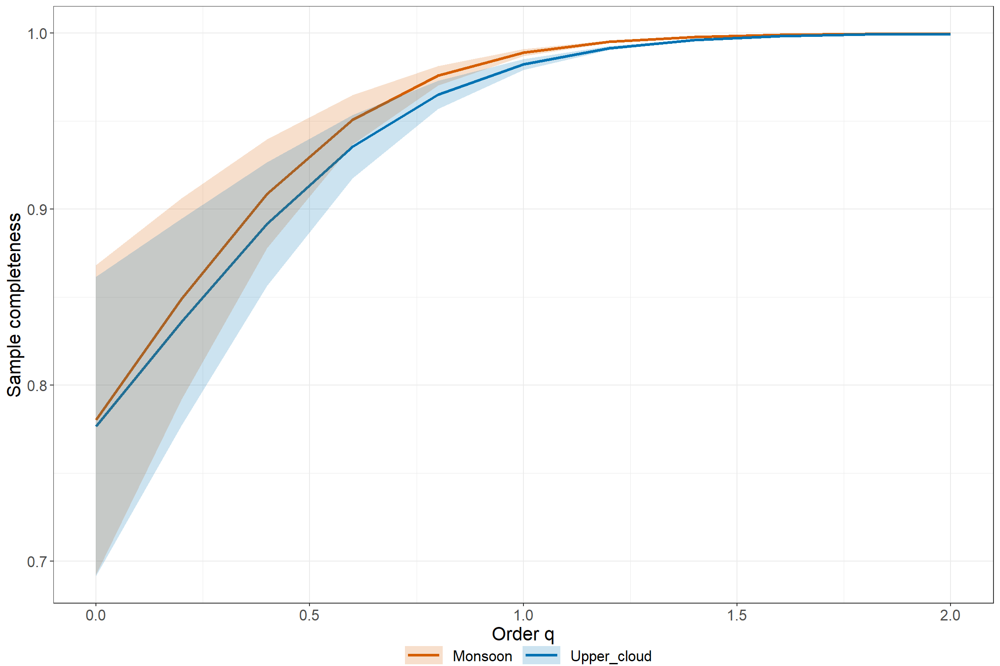
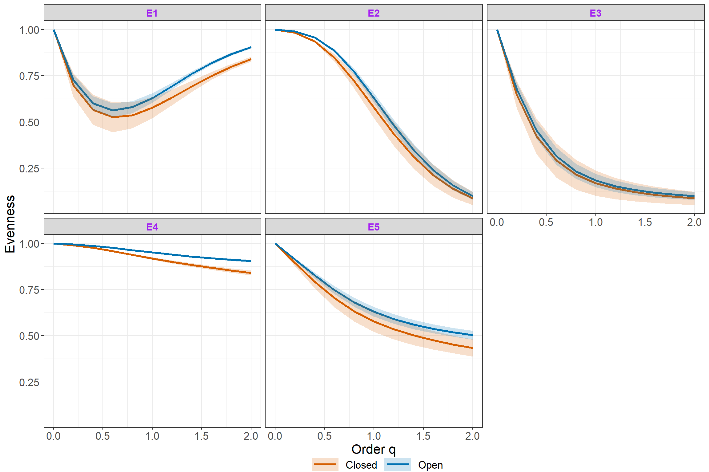
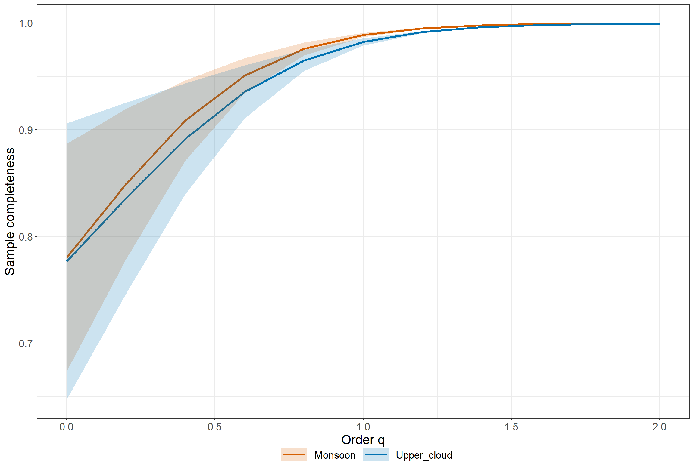

<!-- README.md is generated from README.Rmd. Please edit that file -->

# iNEXT.4steps (R package)

<h5 align="right">
Latest version: 2023-08-05
</h5>
<font color="394CAE">
<h3 color="394CAE" style="font-weight: bold">
Introduction to iNEXT.4steps (R package): Excerpt from iNEXT.4steps
User’s Guide
</h3>
</font> <br>
<h5>
<b>Anne Chao, Kai-Hsiang Hu</b> <br><br> <i>Institute of Statistics,
National Tsing Hua University, Hsin-Chu, Taiwan 30043</i>
</h5>

<br> iNEXT.4steps (iNterpolation and EXTrapolation for four steps) is an
original R package available in [Github](https://github.com/AnneChao)
which provide an easy complete biological analysis computation. In Chao
et al. (2020) paper, they proposed a complete biological analysis
process:

-   `STEP1`. Sample completeness profiles.

-   `STEP2`. Size-based rarefaction and extrapolation analysis and the
    asymptotic diversity profile.

-   `STEP3`. Non-asymptotic coverage-based rarefaction and extrapolation
    analysis.

-   `STEP4`. Evenness among species abundances.

These are the foundation of `iNEXT.4steps`. Here we will introduce
functions about `STEP1` and `STEP4`, particularly. If you want to grasp
the functions of `STEP2`, `STEP3` individually, then please search the
related paper Hsieh et al. (2016) or the package
[iNEXT.3D](https://github.com/AnneChao/iNEXT.3D) from Anne Chao’s github
to get more details. An online version of [iNEXT.4steps
Online](https://chao.shinyapps.io/iNEXT_4steps/) is also available for
users without an R background. Detailed information about all functions
in iNEXT.4steps is provided in the iNEXT.4steps Manual in
[iNEXT.4steps_vignettes](http://chao.stat.nthu.edu.tw/wordpress/wp-content/uploads/software/A%20Quick%20Introduction%20to%20iNEXT.4steps%20via%20Examples.html),which
is available from [Anne Chao’s
website](http://chao.stat.nthu.edu.tw/wordpress/software_download/).

`iNEXT.3D` contains two major parts:

1.  Non-asymptotic diversity:

(1a) Sample-size-based (or size-based) R/E sampling curves: `iNEXT3D`
computes rarefied and extrapolated `taxonomic`, `phylogenetic`, or
`functional` diversity estimates under a specified sample size. This
type of diversity curve plots the estimated diversity with respect to
sample size.

(1b) Sample-coverage-based (or coverage-based) R/E sampling curves:
`iNEXT3D` computes rarefied and extrapolated `taxonomic`,
`phylogenetic`, or `functional` diversity estimates under a specified
sample coverage. This type of diversity curve plots the estimated
diversity with respect to sample coverage.

1.  Asymptotic diversity: asymptotic `taxonomic`, `phylogenetic` or
    `functional` diversity estimate with q-profile, time-profile, and
    tau-profile.

In `iNEXT.4steps` package, we provide other four functions for users to
calculate and visualize the related biological statistics:
`Completeness` and `Evenness` for calculation, and `ggCompleteness` and
`ggEvenness` for visualization. The most comprehensive function
`iNEXT4steps` gathers `iNEXT3D`, `AO3D`, `Completeness` and `Evenness`
into a summary table and a figure. In this document, we will give a
quick introduction demonstrating how to run these functions. Detailed
information about these function settings is provided in the
`iNEXT.4steps` manual, which will be submitted to \[CRAN\]. The
theoretical basis about these biological statistics can be obtained from
the following inference:
(<http://chao.stat.nthu.edu.tw/wordpress/paper/135.pdf>)

### SOFTWARE NEEDED TO RUN iNEXT.4steps IN R

-   Required: [R](http://cran.rstudio.com/)
-   Suggested: [RStudio IDE](http://www.rstudio.com/ide/download/)

## HOW TO RUN INEXT:

The `iNEXT.4steps` package will be submitted to \[CRAN\] and can be
downloaded from Anne Chao’s
[iNEXT.4steps_github](https://github.com/AnneChao/iNEXT.4steps) using
the following commands. For a first-time installation, a related R
package (`iNEXT.3D`) and an additional visualization extension package
(`ggplot2`) must be installed and loaded.

``` r
# install_github('AnneChao/iNEXT.3D')
# library(iNEXT.3D)

## install iNEXT.4steps package from CRAN
# install.packages("iNEXT.4steps")  # coming soon

## install the latest version from github
install.packages('devtools')
library(devtools)
install_github('AnneChao/iNEXT.4steps')

## import packages
library(iNEXT.4steps)
library(ggplot2)
```

## SIMPLE STEPS BRIEF

Step 1: `Sample completeness profile`

`Sample Completeness` represent the proportion of observed species in
the population (Chao et al., 2020). Usually, the sampling data
represents the abundant species in the population so that we will ignore
the rare species. Here we will use Turing’s sample coverage theory to
reconstruct the population proportion. Besides, sample completeness can
correspond to order q, which is an weight index. When order q tends to
zero, then we will give more weight to rare species. If order q tends to
unity, then we will equally treat each species, which is also called
sample coverage at unity. In contrast, if order q tends to larger than
unity, we will give more weights to abundant species. By sample
completeness, we can easily plot the estimated curve with respect to
order q and associated 95% confidence interval.

Step 2.1 and step 3:
`Size-based and coverage-based Interpolation and Extrapolation`

`Interpolation and Extrapolation (iNEXT)` focuses on three measures of
order q: species richness (q = 0), Shannon diversity (q = 1, the
exponential of Shannon entropy), and Simpson diversity (q = 2, the
inverse of Simpson concentration) (Chao and Jost, 2012; Chao et
al. 2014). For each diversity measures, iNEXT uses observed sample to
compute expected diversity estimates and associated 95% confidence
intervals according two different unit types of rarefaction and
extrapolation (R/E):

1.  Sample-size-based R/E sampling curves versus diversity in each order
    q.

2.  Coverage-based R/E sampling curves versus diversity in each order q.

For more particular usage about iNEXT, please refer to Hsieh et
al. (2016). We won’t introduce details of iNEXT latter.

Step 2.2: `Asymptotic diversity profile`

`Asymptotic Diversity (or called Hill numbers)` is a statistic which is
used to represent the biological diversity. Its direct meaning is to
transform the non-homogeneous distribution into homogeneous distribution
(effective number of species). With this quantification criterian, we
can easily analysis several communities for different data sources in an
objective measure. It usually matches order q to give different weights
so that we can focus on rare species or abundant species. When we use
observed data to calculate empirical diversity, we usually get an
underestimated value. In our package, we will provide an estimated
statistic from Chao and Jost (2015), which can imitate a real population
accurately. In addition, it can be related to order q index and
associated 95% confidence interval.

Step 4: `Evenness profile`

`Evenness` is an function to calculate whether a assemblage is uniform
or not. We have sorted five main classes according to different
transformation by species and diversity (Chao and Ricotta, 2019). In
these five classes, they all have range from zero to one. When the value
is close to zero, it means that the assemblage tends to uneven. On the
contrary, when the value is close one, it means that the assemblage
tends to uniform. Evenness considers different order q under each
classes. When order q tends to zero, we will focus on rare species. In
other sides, when order q tends to far from zero, then we will give more
weights on abundant species. If we use observed sampling data to
calculate Evenness, we usually have a biased value because of unobserved
rare species. But if we try to use asymptotic diversity for calculating
Evenness, then we may get a upper bound value. Here, we propose a
“standardized coverage” (named `Cmax`) as a judged criterion. `Cmax`
means that we computes the diversity estimates for the minimum sample
coverage among all samples extrapolated to double reference sizes. Under
Cmax, we can guarantee the accuracy of Evenness. According to this
criterion, we can plot the Evenness curves versus order q and associated
95% confidence interval.

The steps 2.1, 2.2, and 3 can also be promoted to phylogenetic diversity
and functional diversity under attribute diversity framework; see Chao
et al. (2019, 2021) to get more details.

## DATA FORMAT/INFORMATION

Three types of data are supported:

1.  Individual-based abundance data (`datatype="abundance"`): Input data
    for each assemblage/site include species abundances in an empirical
    sample of n individuals (“reference sample”). When there are N
    assemblages, input data consist of an S by N abundance matrix, or N
    lists of species abundances.

2.  Sampling-unit-based incidence data: There are two kinds of input
    data.  

<!-- -->

1.  Incidence-raw data (`datatype="incidence_raw"`): for each
    assemblage, input data for a reference sample consisting of a
    species-by-sampling-unit matrix; each element in the raw matrix is 1
    for a detection, and 0 otherwise. When there are N assemblages,
    input data consist of N lists of raw matrices, and each matrix is a
    species-by-sampling-unit matrix.  
2.  Incidence-frequency data (`datatype="incidence_freq"`): input data
    for each assemblage consist of species sample incidence frequencies
    (i.e., row sums of the corresponding incidence raw matrix). When
    there are N assemblages, input data consist of an (S+1) by N matrix,
    or N lists of species incidence frequencies. The first entry of each
    column/list must be the total number of sampling units, followed by
    the species incidence frequencies.

## MAIN FUNCTION: iNEXT4steps()

We first describe the main function `iNEXT4steps()` with default
arguments:

``` r
iNEXT4steps(data, diversity = "TD", q = seq(0, 2, 0.2), datatype = "abundance",
            nboot = 50, nT = NULL,
            PDtree = NULL, PDreftime = NULL, PDtype = "meanPD",
            FDdistM = NULL, FDtype = "AUC", FDtau = NULL,
            details = FALSE
)
```

The arguments of this function are briefly described below, and will
explain details by illustrative examples in later text.

<table class='gmisc_table' style='border-collapse: collapse; margin-top: 1em; margin-bottom: 1em;' >
<thead>
<tr>
<th style="font-weight: 900; border-bottom: 1px solid grey; border-top: 2px solid grey; text-align: center;">
Argument
</th>
<th style="font-weight: 900; border-bottom: 1px solid grey; border-top: 2px solid grey; text-align: center;">
Description
</th>
</tr>
</thead>
<tbody>
<tr>
<td style="text-align: left;">
data
</td>
<td style='text-align: left;'>

1.  For `datatype = 'abundance'`, data can be input as a vector of
    species abundances (for a single assemblage), matrix/data.frame
    (species by assemblages), or a list of species abundance
    vectors. (2) For `datatype = 'incidence_freq'`, data can be input as
    a vector of incidence frequencies (for a single assemblage),
    matrix/data.frame (species by assemblages), or a list of incidence
    frequencies; the first entry in all types of input must be the
    number of sampling units in each assemblage. (3) For
    `datatype = 'incidence_raw'`, data can be input as a list of
    matrix/data.frame (species by sampling units); data can also be
    input as a matrix/data.frame by merging all sampling units across
    assemblages based on species identity; in this case, the number of
    sampling units (nT, see below) must be input.
    </td>
    </tr>
    <tr>
    <td style="text-align: left;">
    diversity
    </td>
    <td style="text-align: left;">
    selection of diversity type: ‘TD’ = Taxonomic diversity, ‘PD’ =
    Phylogenetic diversity, and ‘FD’ = Functional diversity.
    </td>
    </tr>
    <tr>
    <td style="text-align: left;">
    q
    </td>
    <td style="text-align: left;">
    a numerical vector specifying the diversity orders. Default is c(0,
    1, 2).
    </td>
    </tr>
    <tr>
    <td style="text-align: left;">
    datatype
    </td>
    <td style="text-align: left;">
    data type of input data: individual-based abundance data (datatype =
    ‘abundance’), sampling-unit-based incidence frequencies data
    (datatype = ‘incidence_freq’), or species by sampling-units
    incidence matrix (datatype = ‘incidence_raw’) with all entries being
    0 (non-detection) or 1 (detection).
    </td>
    </tr>
    <tr>
    <td style="text-align: left;">
    nboot
    </td>
    <td style="text-align: left;">
    a positive integer specifying the number of bootstrap replications
    when assessing sampling uncertainty and constructing confidence
    intervals. Enter 0 to skip the bootstrap procedures. Default is 50.
    </td>
    </tr>
    <tr>
    <td style="text-align: left;">
    nT
    </td>
    <td style="text-align: left;">
    (required only when datatype = ‘incidence_raw’ and input data is
    matrix/data.frame) a vector of nonnegative integers specifying the
    number of sampling units in each assemblage. If assemblage names are
    not specified, then assemblages are automatically named as
    ‘assemblage1’, ‘assemblage2’,…, etc.
    </td>
    </tr>
    <tr>
    <td style="text-align: left;">
    PDtree
    </td>
    <td style="text-align: left;">
    (required only when diversity = ‘PD’), a phylogenetic tree in Newick
    format for all observed species in the pooled assemblage.
    </td>
    </tr>
    <tr>
    <td style="text-align: left;">
    PDreftime
    </td>
    <td style="text-align: left;">
    (required only when diversity = ‘PD’), a vector of numerical values
    specifying reference times for PD. Default is NULL (i.e., the age of
    the root of PDtree).
    </td>
    </tr>
    <tr>
    <td style="text-align: left;">
    PDtype
    </td>
    <td style="text-align: left;">
    (required only when diversity = ‘PD’), select PD type: PDtype = ‘PD’
    (effective total branch length) or PDtype = ‘meanPD’ (effective
    number of equally divergent lineages). Default is ‘meanPD’, where
    meanPD = PD/tree depth.
    </td>
    </tr>
    <tr>
    <td style="text-align: left;">
    FDdistM
    </td>
    <td style="text-align: left;">
    (required only when diversity = ‘FD’), select FD type: FDtype =
    ‘tau_values’ for FD under specified threshold values, or FDtype =
    ‘AUC’ (area under the curve of tau-profile) for an overall FD which
    integrates all threshold values between zero and one. Default is
    ‘AUC’.
    </td>
    </tr>
    <tr>
    <td style="text-align: left;">
    FDtype
    </td>
    <td style="text-align: left;">
    (required only when diversity = ‘FD’), select FD type: FDtype =
    ‘tau_values’ for FD under specified threshold values, or FDtype =
    ‘AUC’ (area under the curve of tau-profile) for an overall FD which
    integrates all threshold values between zero and one. Default is
    ‘AUC’.
    </td>
    </tr>
    <tr>
    <td style="text-align: left;">
    FDtau
    </td>
    <td style="text-align: left;">
    (required only when diversity = ‘FD’ and FDtype = ‘tau_values’), a
    numerical vector between 0 and 1 specifying tau values (threshold
    levels). If NULL (default), then threshold is set to be the mean
    distance between any two individuals randomly selected from the
    pooled assemblage (i.e., quadratic entropy).
    </td>
    </tr>
    <tr>
    <td style="border-bottom: 2px solid grey; text-align: left;">
    details
    </td>
    <td style="border-bottom: 2px solid grey; text-align: left;">
    a logical variable to decide whether do you want to print out the
    detailed value for each plots, default is `FALSE`.
    </td>
    </tr>
    </tbody>
    </table>

Here the input data format can be several formats, such as a vector
gathered by factors (`abundance` and `incidence_freq`), a matrix/data
frame with species versus a assemblage (`abundance` `incidence_freq`,
and `incidence_raw`), a list of several vectors (`abundance` and
`incidence_freq`), or a list correspond to a assemblage
(`incidence_raw`). `data` should comform the format of each datatype.
When `datatype = "incidence_raw"` and class of data is matrix/data
frame, user should input `nT` for each assemblage which represents
sampling units.

The output of `iNEXT4steps` will have three parts (if `details = TRUE`):
`$summary`, `$figure`, and `$details`. It may take some time to compute
five figures when data size is large or `nboot` is large.

## Taxonomic Diversity

`“abundance Data”` is used for a random sampling scheme. If the species
has aggregation effect, such as trees or plants, then set
`datatype = “incidence_freq”` or `datatype = “incidence_raw”`. First, we
use data `Spider` to compute taxonomic diversity.

## Abundance-based

Datasets `Spider` were sampled in a mountain forest ecosystem in the
Bavarian Forest National Park, Germany (Thorn et al. 2016, 2017). A
total of 12 experimental plots were established in “closed forest”
stands (6 plots) and “open forest” stands with naturally occurring gaps
and edges (6 plots) to assess the effects of microclimate on communities
of epigeal (ground-dwelling) spiders. Epigeal spiders were sampled over
three years with four pitfall traps in each plot, yielding a total of
3171 individuals belonging to 85 species recorded in the pooled habitat.
More details refer to data Source : A mountain forest ecosystem in the
Bavarian Forest National Park, Germany (Thorn et al. 2016, 2017).

``` r
data(Spider)
out1 <- iNEXT4steps(data = Spider, diversity = "TD", datatype = "abundance")
out1$summary
$`STEP1. Sample completeness profiles`
  Assemblage q = 0 q = 1 q = 2
1     Closed  0.61  0.99     1
2       Open  0.77  0.99     1

$`STEP2. Asymptotic analysis`
  Assemblage         Diversity Observed Estimator  s.e.   LCL    UCL
1     Closed  Species richness    44.00     72.11 35.73 44.00 142.14
2     Closed Shannon diversity    10.04     10.30  0.34  9.64  10.96
3     Closed Simpson diversity     5.71      5.73  0.19  5.35   6.10
4       Open  Species richness    74.00     96.31 13.40 74.00 122.56
5       Open Shannon diversity    16.34     16.84  0.62 15.62  18.05
6       Open Simpson diversity     9.41      9.46  0.39  8.70  10.22

$`STEP3. Non-asymptotic coverage-based rarefaction and extrapolation analysis`
  Cmax = 0.994 q = 0 q = 1 q = 2
1       Closed 55.62 10.18  5.72
2         Open 86.51 16.59  9.43

$`STEP4. Evenness among species abundances`
       Pielou J' q = 1 q = 2
Closed      0.58  0.17  0.09
Open        0.63  0.18  0.10
out1$figure[[6]]
```


`$summary` lists all biological summaries according to Chao et
al. (2020). There are four parts corresponding to each step in the
paper. They analysis and explain biological data from different and
superimposed side. User can easily compare difference between each
assemblages.

`$figure` visualize the statistics by continuous curves. From the above
five figures, `iNEXT4stpes` provides a standard analysis process from
figure (a) to figure (e). User can analyze the process of biodiversity
through these figures.

`$details` contains four parts: `Sample Completeness`, `iNEXT`,
`Asymptotic Diversity`, `Evenness`. They are the computing values which
are used to plot each figure in `$figure`.

## Incidence-based

Incidence data is matched by incidence-sampling-units. We split a space
into several quadrats and only record whether the species is detected or
undetected in each quadrat. According to this sampling scheme,
`incidence_raw` data has only value “zero” (undetected) or “one”
(detected) in matrix/data frame (species by assemblages).
`incidence_freq` data is the total incidence frequency for each species
(i.e., row sums of the corresponding incidence raw matrix).
`incidence_freq` data should contain total sampling units (number of
quadrats) in the first row/entry.

*Remark:* The phylogenetic diversity can only select
`datatype = “incidence_raw”` for incidence-based data.

Datasets `Woody plants` are a subset of The National Vegetation Database
of Taiwan (AS-TW-001), sampled between 2003 and 2007 within the first
national vegetation inventory project (Chiou et al. 2009). Over 3600
vegetation plots, each 20x20-m in area, were set up in various locations
in Taiwan, and all woody plant individuals taller than 2 meters were
recorded in each plot. For illustration here, we selected only plots
belonging to two vegetation types (according to Li et al. 2013):
Pyrenaria-Machilus subtropical winter monsoon forest and Chamaecyparis
montane mixed cloud forest, sampled in the northern part of Taiwan (in
ecoregions 7 and 8 according to Su 1985).

``` r
data(woody_plants)
out2 <- iNEXT4steps(data = woody_plants[,c(1,4)], diversity = "TD", datatype = "incidence_freq")
out2$summary
$`STEP1. Sample completeness profiles`
   Assemblage q = 0 q = 1 q = 2
1     Monsoon  0.78  0.99     1
2 Upper_cloud  0.78  0.98     1

$`STEP2. Asymptotic analysis`
   Assemblage         Diversity Observed Estimator  s.e.    LCL    UCL
1     Monsoon  Species richness   329.00    421.67 19.67 383.13 460.22
2     Monsoon Shannon diversity   145.65    150.15  2.00 146.23 154.07
3     Monsoon Simpson diversity   102.33    103.35  1.47 100.46 106.23
4 Upper_cloud  Species richness   239.00    307.78 24.44 259.89 355.67
5 Upper_cloud Shannon diversity   105.53    110.50  1.96 106.66 114.34
6 Upper_cloud Simpson diversity    71.17     72.23  1.37  69.54  74.91

$`STEP3. Non-asymptotic coverage-based rarefaction and extrapolation analysis`
  Cmax = 0.993  q = 0  q = 1  q = 2
1      Monsoon 359.80 147.29 102.67
2  Upper_cloud 278.96 108.52  71.69

$`STEP4. Evenness among species abundances`
            Pielou J' q = 1 q = 2
Monsoon          0.85  0.41  0.28
Upper_cloud      0.83  0.39  0.25
out2$figure[[6]]
```


## Phylogenetic Diversity

Here use abundance data : `“brazil”` as example. `“brazil”` data has two
main communities: “Edge”, “Interior”. Here we also provide phylogenetic
tree data and pairwise distance matrix of `“brazil”` data to compute
phylogenetic diversity and functional diversity.

According to following R code, user can get similar output with
taxonomic diversity.

``` r
data(brazil)
data(brazil_tree)
out3 <- iNEXT4steps(data = brazil, diversity = "PD", datatype = "abundance", nboot = 20, PDtree = brazil_tree)
out3$summary
$`STEP1. Sample completeness profiles`
  Assemblage q = 0 q = 1 q = 2
1       Edge  0.72  0.94     1
2   Interior  0.69  0.94     1

$`STEP2. Asymptotic analysis`
  Assemblage Phylogenetic.Diversity Phylogenetic.Observed Phylogenetic.Estimator s.e.   LCL   UCL Reftime   Type
1       Edge               q = 0 PD                 61.29                  80.03 4.12 71.96 88.10     400 meanPD
2       Edge               q = 1 PD                  5.25                   5.37 0.14  5.09  5.65     400 meanPD
3       Edge               q = 2 PD                  1.80                   1.80 0.03  1.74  1.85     400 meanPD
4   Interior               q = 0 PD                 69.32                  86.38 4.41 77.74 95.01     400 meanPD
5   Interior               q = 1 PD                  5.72                   5.85 0.13  5.59  6.11     400 meanPD
6   Interior               q = 2 PD                  1.91                   1.91 0.04  1.85  1.98     400 meanPD

$`STEP3. Non-asymptotic coverage-based rarefaction and extrapolation analysis`
  Cmax = 0.973 q = 0 q = 1 q = 2
1         Edge 71.76  5.32  1.80
2     Interior 80.32  5.80  1.91

$`STEP4. Evenness among species abundances`
         Pielou J' q = 1 q = 2
Edge          0.86  0.43  0.21
Interior      0.85  0.40  0.16
out3$figure[[6]]
```


## Functional Diversity

Here abundance data `brazil` and its pairwise distance matrix to compute
functional diversity. Under `FDtype = "tau_values"`, user can key in
`FDtau` as thresholds. If `FDtau` is small, all species will tend to
different functional groups. If `FDtau` is large, all species will tend
to the same functional group.

``` r
data(brazil)
data(brazil_distM)
out4 <- iNEXT4steps(data = brazil, diversity = "FD", datatype = "abundance", nboot = 20, FDdistM = brazil_distM, FDtype = 'tau_values')
out4$summary
$`STEP1. Sample completeness profiles`
  Assemblage q = 0 q = 1 q = 2
1       Edge  0.72  0.94     1
2   Interior  0.69  0.94     1

$`STEP2. Asymptotic analysis`
  Assemblage Functional.Diversity Functional.Observed Functional.Estimator s.e.  LCL  UCL  Tau
1       Edge q = 0 FD(single tau)                6.86                 6.86 0.19 6.86 7.24 0.35
2       Edge q = 1 FD(single tau)                6.52                 6.54 0.13 6.28 6.80 0.35
3       Edge q = 2 FD(single tau)                6.26                 6.28 0.12 6.05 6.50 0.35
4   Interior q = 0 FD(single tau)                5.91                 5.91 0.06 5.91 6.02 0.35
5   Interior q = 1 FD(single tau)                5.19                 5.20 0.08 5.05 5.35 0.35
6   Interior q = 2 FD(single tau)                4.72                 4.72 0.09 4.56 4.89 0.35

$`STEP3. Non-asymptotic coverage-based rarefaction and extrapolation analysis`
  Cmax = 0.973 q = 0 q = 1 q = 2
1         Edge  6.86  6.53  6.27
2     Interior  5.91  5.20  4.72

$`STEP4. Evenness among species abundances`
         Pielou J' q = 1 q = 2
Edge          0.86  0.43  0.21
Interior      0.85  0.40  0.16
out4$figure[[6]]
```


### MAIN FUNCTION: Completeness()

`iNEXT.4steps` provides function `Completeness()` to compute estimated
sample completeness with order q. The arguments is below:

``` r
Completeness(data, q = seq(0, 2, 0.2), datatype = "abundance", nboot = 50, conf = 0.95, nT = NULL)
```

### MAIN FUNCTION: ggCompleteness()

`iNEXT.4steps` also provides a visualized function `ggCompleteness` to
plot the output from `Completeness()`:

``` r
ggCompleteness(output)
```

There are two simple examples for functions `Completeness` and
`ggCompleteness`. One is abundance-based and the other is
incidence-based data.

## Abundance-based

Use abundance data `Spider` to compute sample completeness and plot it.

``` r
data(Spider)
out1 <- Completeness(data = Spider, datatype = "abundance")
ggCompleteness(out1)
```


## Incidence-based

Use incidence frequency data `woody plants` to compute sample
completeness and plot it.

``` r
data(woody_plants)
out2 <- Completeness(data = woody_plants[,c(1,4)], datatype = "incidence_freq")
ggCompleteness(out2)
```



## MAIN FUNCTION: Evenness()

`iNEXT.4steps` provides the function `Evenness()` to compute observed
(empirical) eveness or estimated evenness under specified sample
coverage. The arguments is below:

``` r
Evenness(data, q = seq(0, 2, 0.2), datatype = "abundance", method = "Estimated",
         nboot = 50, conf = 0.95, nT = NULL, E.class = 1:5, C = NULL)
```

### GRAPHIC DISPLAYS FUNCTION: ggEvenness()

## MAIN FUNCTION: ggEvenness()

`iNEXT.4steps` provide a function `ggEvenness()` to plot the output from
`Evenness()`.

``` r
ggEvenness(output)
```

There are two simple examples for functions `Evenness` and `ggEvenness`.
One is abundance-based and the other is incidence-based data.

## Abundance-based

Use abundance data `Spider` to calculate estimated evenness under
`C = Cmax` and plot it.

``` r
data(Spider)
out1 <- Evenness(data = Spider, datatype = "abundance")
ggEvenness(out1)
```



## Incidence-based

Use incidence frequency data `Woody plants` to calculate estimated
evenness under `C = Cmax` and plot it.

``` r
data(woody_plants)
out2 <- Evenness(data = woody_plants[,c(1,4)], datatype = "incidence_freq")
ggEvenness(out2)
```



### How to cite

-   Chao, A., Y. Kubota, D. Zelený, C.-H. Chiu, C.-F. Li, B.
    Kusumoto, M. Yasuhara, S. Thorn, C.-L. Wei, M. J. Costello,
    and R. K. Colwell (2020). Quantifying sample completeness and
    comparing diversities among assemblages. Ecological Research, 35,
    292-314.

## License

The iNEXT.4steps package is licensed under the GPLv3. To help refine
`iNEXT.4steps`, your comments or feedback would be welcome (please send
them to Anne Chao or report an issue on the iNEXT.4steps github
[iNEXT.4steps_github](https://github.com/AnneChao/iNEXT.4steps).

## References

-   Chao, A., Chiu, C.-H., Villéger, S., Sun, I.-F., Thorn, S., Lin,
    Y.-C., Chiang, J. M. and Sherwin, W. B. (2019). An
    attribute-diversity approach to functional diversity, functional
    beta diversity, and related (dis)similarity measures. Ecological
    Monographs, 89, e01343. 10.1002/ecm.1343.

-   Chao, A., Gotelli, N. G., Hsieh, T. C., Sander, E. L., Ma, K. H.,
    Colwell, R. K. and Ellison, A. M. (2014). Rarefaction and
    extrapolation with Hill numbers: a framework for sampling and
    estimation in species biodiversity studies. Ecological Monographs
    84, 45-67.

-   Chao, A., Henderson, P. A., Chiu, C.-H., Moyes, F., Hu, K.-H.,
    Dornelas, M and Magurran, A. E. (2021). Measuring temporal change in
    alpha diversity: a framework integrating taxonomic, phylogenetic and
    functional diversity and the iNEXT.3D standardization. Methods in
    Ecology and Evolution, 12, 1926-1940.

-   Chao, A. and Jost. L. (2012) Coverage-based rarefaction and
    extrapolation: standardizing samples by completeness rather than
    size. Ecology, 93, 2533-2547.

-   Chao, A. and Jost, L. (2015). Estimating diversity and entropy
    profiles via discovery rates of new species. Methods in Ecology and
    Evolution, 6, 873-882.

-   Chao, A. and Ricotta, C. (2019). Quantifying evenness and linking it
    to diversity, beta diversity, and similarity. Ecology, 100(12),
    e02852.

-   Chao, A., Y. Kubota, D. Zelený, C.-H. Chiu, C.-F. Li, B.
    Kusumoto, M. Yasuhara, S. Thorn, C.-L. Wei, M. J. Costello,
    and R. K. Colwell (2020). Quantifying sample completeness and
    comparing diversities among assemblages. Ecological Research, 35,
    292-314.

-   Chiou, C.-R., Hsieh, C.-F., Wang, J.-C., Chen, M.-Y., Liu, H.-Y.,
    Yeh, C.-L., … Song, M. G.-Z. (2009). The first national vegetation
    inventory in Taiwan. Taiwan Journal of Forest Science, 24, 295–302.

-   Li, C.-F., Chytrý, M., Zelený, D., Chen, M. -Y., Chen, T.-Y., Chiou,
    C.-R., … Hsieh, C.-F. (2013). Classification of Taiwan forest
    vegetation. Applied Vegetation Science, 16, 698–719.
    <https://doi.org/10.1111/avsc.12025>

-   Su, H. -J. (1985). Studies on the climate and vegetation types of
    the natural forests in Taiwan (III) A Scheme of Geographical
    Climatic Regions. Quarterly Journal of Chinese Forestry, 18, 33–44.

-   T.C. Hsieh, K. H. Ma, and Chao, A. (2016). iNEXT: An R package for
    rarefaction and extrapolation of species diversity (Hill numbers).
    Methods in Ecology and Evolution, 7, 1451-1456.

-   Thorn, S., Bässler, C., Svoboda, M., & Müller, J. (2017). Effects of
    natural disturbances and salvage logging on biodiversity - lessons
    from the bohemian Forest. Forest Ecology and Management, 388,
    113–119. <https://doi.org/10.1016/j.foreco.2016.06.006>

-   Thorn, S., Bußler, H., Fritze, M. -A., Goeder, P., Müller, J., Weiß,
    I., & Seibold, S. (2016). Canopy closure determines arthropod
    assemblages in microhabitats created by windstorms and salvage
    logging. Forest Ecology and Managemen
